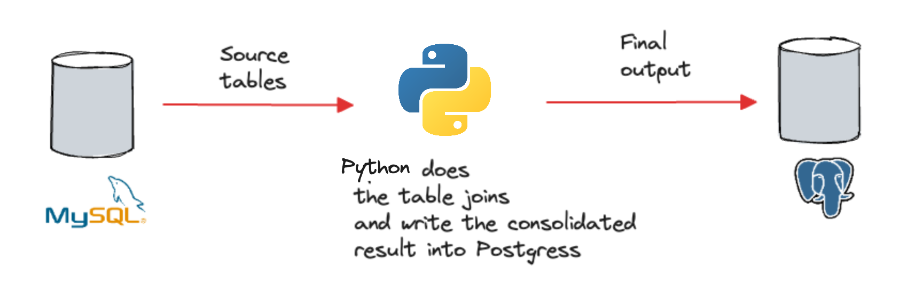

Assume we have an online store that uses MySQL as the transactional database, capturing operational information, such as orders, payments, products, etc.

The business wants to know key metrics like top-selling products to stay on alert on the inventory levels. To achieve that, we will build a data pipeline that moves transactional data from MySQL to Postgres, which we will use for running analytics later. 

You will build a batch ETL pipeline that runs periodically to extract required tables from the source database, perform table joins to calculate the top selling products, and write the results into a table in Postgres database, which will be used for running sales anaytics.



Go ahead and start the services by running:

```
docker-compose up -d
```{{exec}}

This pipeline starts the following containers:
- `mysql` as the source database.
- `postgres` as the destination database.
- `etl` as a Python script performing the ETL job.

