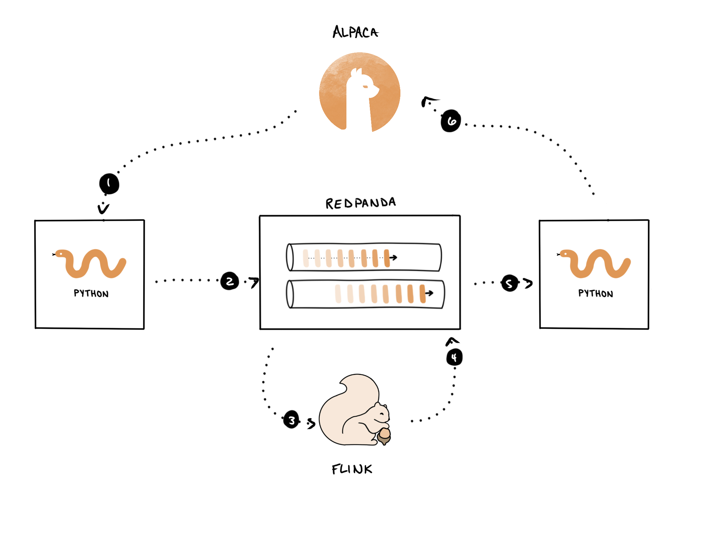

The way the application works is shown in this diagram.

1. You'll create a Redpanda producer that will read market news / prices for `TSLA`{{}} from <a href="https://alpaca.markets" target="_blank">Alpaca</a>. It will determine the sentiment of each headline and enrich the raw data with this info.

2. The producer will write the enriched records to Redpanda.

3. You’ll deploy a Flink query that consumes a continuous stream of market news and pricing updates.

    Whenever the sentiment for a symbol is particularly high (`> 0.4`{{}}), you’ll issue a `BUY`{{}}. If the sentiment is particularly low (`< -0.4`{{}}), you’ll issue a `SELL`{{}} signal.

4. Flink will write the trade signals to Redpanda.

5. A Redpanda consumer application, written, in Python, will consume the trade signals and issue a corresponding trade inside of an Alpaca paper trading environment.

6. Alpaca will receieve the request and either buy or sell a position in `TSLA`{{}}. Don't worry, this will be inside a paper trading account so you won't be using live funds.