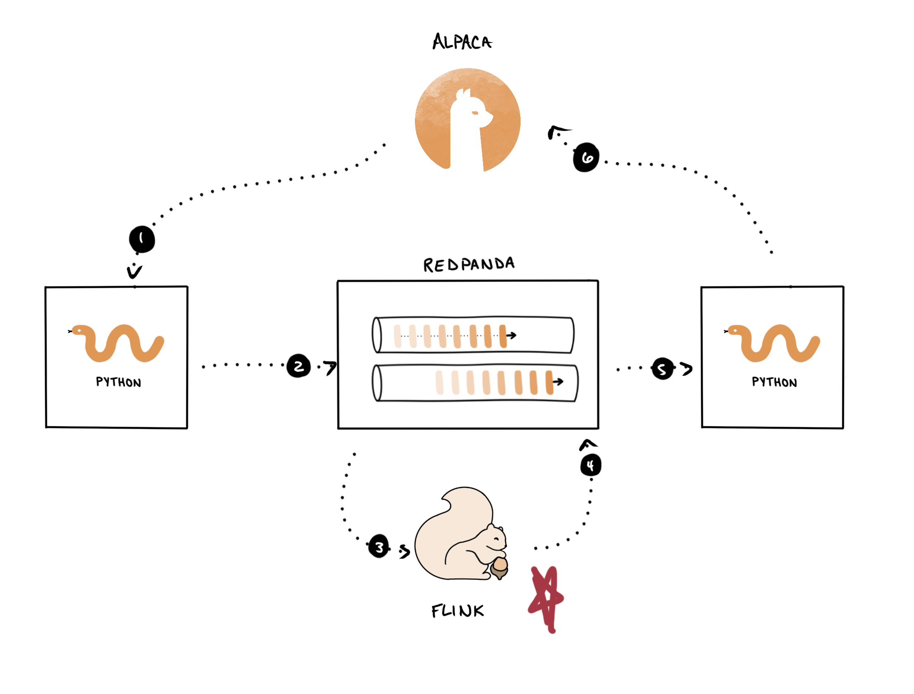

To save some time, we went ahead and implemented the strategy for you using Flink SQL. You can view the queries in the source repository, and the most important section of the logic can be viewed <a href="https://github.com/redpanda-data-university/rp-use-cases-algo-trading/blob/f9b79f397ae52d9186e8d21be2c0c8907b70caf3/03-strategy-testing/sql/strategy.sql#L87-L104" target="_blank">here</a>.

The job you just deployed, with the above SQL, corresponds to this step in our pipeline.

If you really want to run the queries by yourself, please see the __Masterclass 3: Flink SQL Algorithmic Trading__ scenario on <a href="https://killercoda.com/redpanda/" target="_blank">this page</a>. It's an alternate form of this scenario with more of a focus on the queries and less on paper trading.