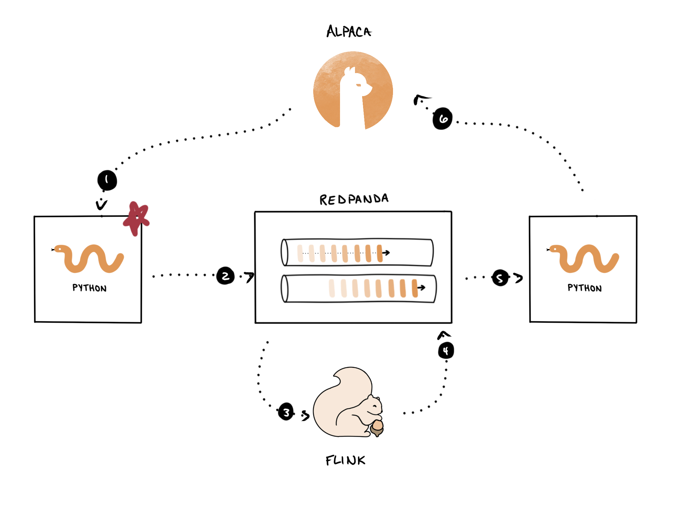

Now, we need to deploy a job that will consume the raw data from Alpaca, perform sentiment analysis on news headlines, and write the results to Redpanda. In other words, we need to deploy this part of our pipeline:



In order to perform sentiment analysis on the market data, and also to execute trades, you need to install some Python dependencies. Run the following command to do so.

```
pip install -r requirements.txt
```{{exec}}

You may see some minor errors or warnings. Don't worry about that, just wait for the command to finish running.

You'll use the VADER lexicon to actually perform the sentiment analysis. We've included this in the source, you just need to run the following command to move it into a place that is discoverable by the Python library.

```
mv nltk_data /root/nltk_data
```{{exec}}

Our strategy involves appending the sentiment score at the time we save the record to Redpanda. This simplifies our Flink job since we don't need to create a custom SQL function to handle this for us. You can view <a href="https://github.com/redpanda-data-university/rp-use-cases-algo-trading/blob/f9b79f397ae52d9186e8d21be2c0c8907b70caf3/03-strategy-testing/examples/alpaca/historical_news.py#L66-L85" target="_blank">the source code here</a> to get an idea of how we're getting the sentiment.

Further up in the file, you'll see the implementation of the `get_sentiment`{{}} function is quite simple, and relies on `nltk`{{}} to do the hard work.

```python
from nltk.sentiment.vader import SentimentIntensityAnalyzer as SIA

...
# Create a sentiment analyzer
sia = SIA()

def get_sentiment(text):
    scores = sia.polarity_scores(text)
    return scores["compound"]
```{{}}