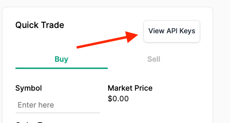
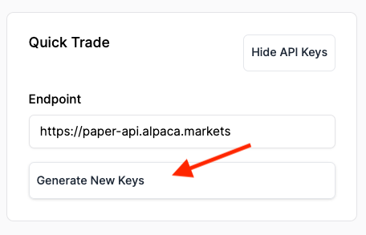
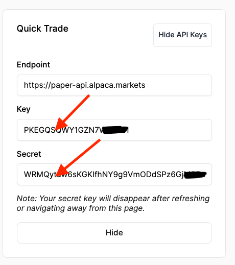

To execute trades, you'll need to create an API key in Alpaca. It takes less than 2 minutes. To do so, <a href="https://app.alpaca.markets/signup" target="_blank">Sign up for an Alpaca account here</a>.

Once you've signed up, sign into your account.

Then visit <a href="https://app.alpaca.markets/paper/dashboard/overview" target="_blank">the paper trading dashboard here</a>.

On the right hand side, you'll see a button that allows you to view your API keys. Click that button.

You'll see another button to generate new keys. Click that button.

Finally, Alpaca will create a __Key__ and __Secret__ for you. Don't close out of that tab since you will need to copy and paste these in the next step.

