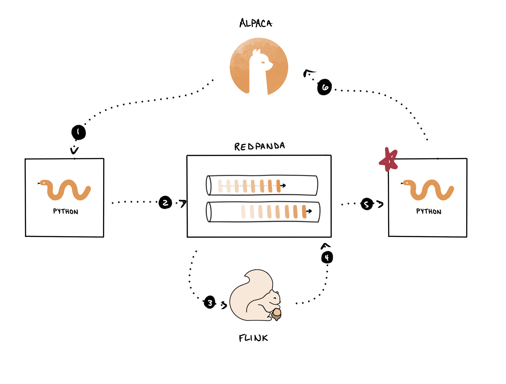

Now, still in `Tab 2`{{}}, start the script that will consume the trade signals from Redpanda (which are coming from Flink), and submit orders when a `BUY`{{}} or `SELL`{{}} signal is received.

```
# from tab 2
cd algo-trading/03-strategy-testing/
python -m examples.alpaca.submit_orders
```{{exec}}

It will look like it's hanging, but it's just listening for trade signals, so keep it running and click Next.

You just deployed this part of the pipeline, which will listen for trade signals from Flink and submit orders to Alpaca.

 