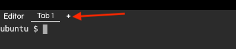

You've been running all of the commands from a single tab in Killercoda. Open up a new tab by clicking the little `+`{{}} icon at the top of the terminal.



 Click on the tab name `Tab 2`{{}} to ensure you run the next few commands from within that tab. The terminal should be empty since you haven't run any commands in this tab before.
 
Now, export your Alpaca key and secret using the following commands. Replace `...`{{}} with the actual values. When you copy and paste these in the terminal, you may need to hit up on your keyboard to edit the values.

```
# from tab 2, add your Alpaca Key
export ALPACA_API_KEY="..."
```{{copy}}

```
# from tab 2, add your Alpaca Secret
export ALPACA_SECRET_KEY="..."
```{{copy}}
