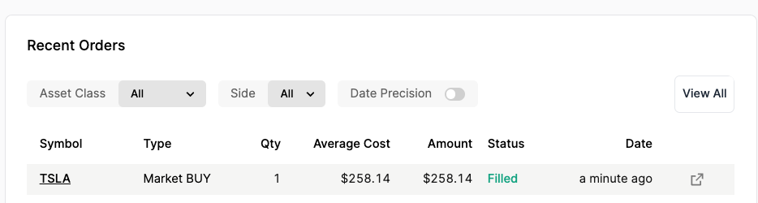

Go back to `Tab 2`{{}}. You should see some output indicating that a purchase was made.

```
Submitting buy order for 5 shares of TSLA
```{{}}

Next, go back to the <a href="https://app.alpaca.markets/paper/dashboard/overview" target="_blank">the paper trading dashboard </a> and scroll down to the __Recent orders__ section. You should see an order was placed for `TSLA`{{}}.

 

Next, go back to the news simulator running in `Tab 1`{{}}. When prompted for another symbol, re-type the following:

```
TSLA
```{{exec}}

Then, provide a headline with negative sentiment:

```
Tesla Analyst Warns Situation Could Turn Uglier
```{{exec}}

Back in `Tab 2`{{}}, you should see that a `SELL`{{}} order was placed. Go back to the Alpaca paper trading dashboard to confirm.