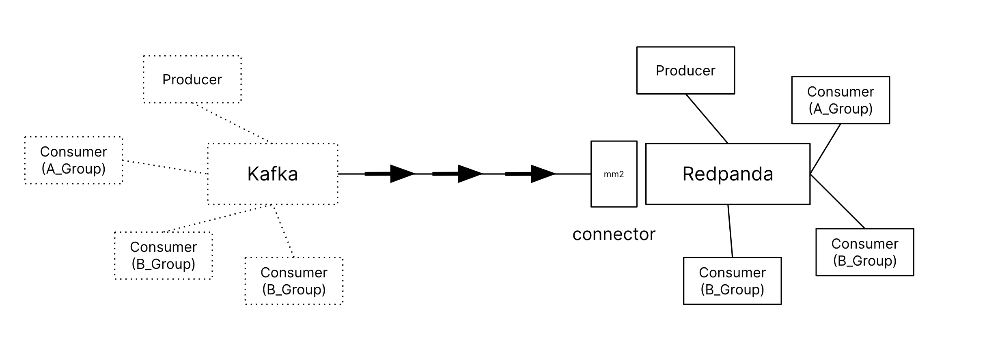
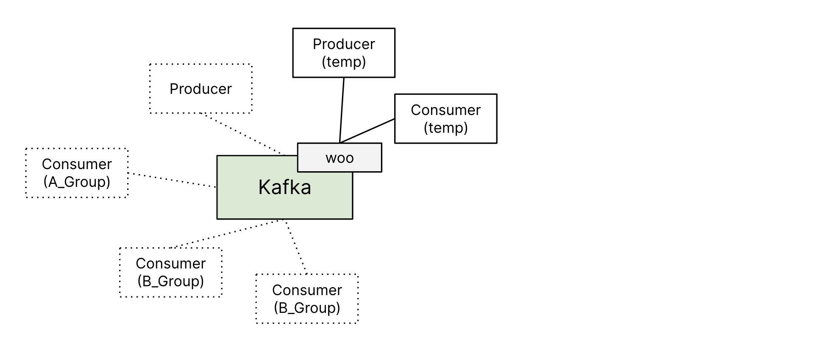
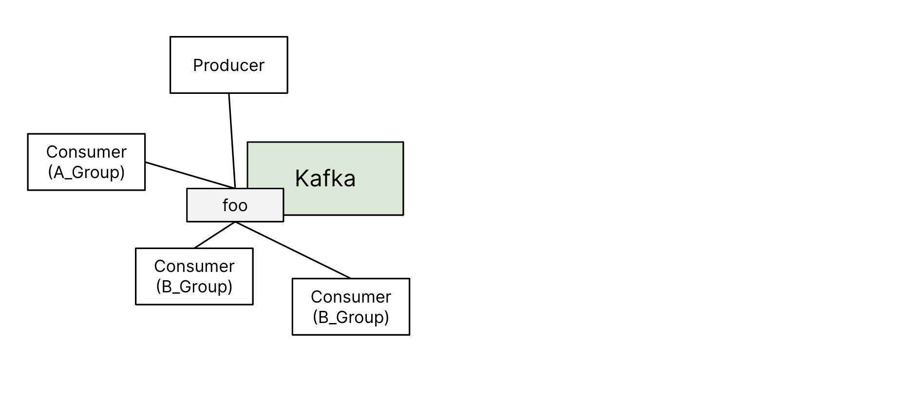

Welcome to the lab, where you will get hands-on experience with migrating data from an Apache Kafka cluster to a Redpanda cluster using MirrorMaker 2.0 (MM2). 



Please be patient for a moment. While we are setting up the lab environment
You'll know that the Kafka instance is active when you see:
```
Creating root_zookeeper_1 ... done
Creating root_kafka_1     ... done
```

### Verify existing Kafka cluster



Firstly, create a new Topic:
```
docker exec -it root_kafka_1 kafka-topics --create --topic woo --partitions 2 --replication-factor 1 --if-not-exists --bootstrap-server localhost:29094
```{{exec}}

It should return a msg that show the topic is successfully created:
```
Created topic woo.
```

*Next*, open a new tab (tab 2) and launch a producer:
```
docker exec -it root_kafka_1 kafka-console-producer --broker-list localhost:29094 --topic woo 
```{{exec}}

In another new tab (tab 3), start a consumer:
```
docker exec -it root_kafka_1 kafka-console-consumer --bootstrap-server localhost:29094 --topic woo 
```{{exec}}

Now, return to tab 2, and try typing to send data to the *woo* topic using the producer. Switch to tab 3 and verify if the consumer receives the data. 

To conclude this step, terminate the producer in tab 2 and the consumer in tab 3 by pressing `Ctrl+C`.


### Initialize the clients

We will activate several consumers and a producer to emulate data streaming into the existing Kafka platform. The setup will include a producer that inputs data randomly into a topic named *foo*, along with 3 consumers: one consumer in group_A and two consumers in group_B. 



Begin by creating a new **Topic** _foo_, in tab 1:

```
docker exec -it root_kafka_1 kafka-topics --create --topic foo --partitions 2 --replication-factor 1 --if-not-exists --bootstrap-server localhost:29094
```{{exec}}

It should return a msg that show the topic is successfully created:
```
Created topic foo.
```

Start the clients:
```
docker-compose -f docker-compose-clients.yaml up -d
```{{exec}}

When see this, your clients are up:
```
Creating mm2consumer-B2 ... done
Creating mm2consumer-B1 ... done
Creating mm2consumer-A  ... done
Creating mm2producer    ... done
```

*OPTIONAL*: 

Verify the producer by consuming from topic _foo_, in tab 3 run:
```
docker exec -it root_kafka_1 kafka-console-consumer --bootstrap-server localhost:29094 --topic foo 
```{{exec}}

Give it a couple of minutes, you should be able to see data randomly generated by the producer
```
{"plantId": 78, "botId": "B35", "fulfillment": 4}
{"plantId": 62, "botId": "B8", "fulfillment": 4}
{"plantId": 26, "botId": "B83", "fulfillment": 2}
{"plantId": 87, "botId": "B67", "fulfillment": 3}
{"plantId": 97, "botId": "B65", "fulfillment": 3}
{"plantId": 71, "botId": "B16", "fulfillment": 4}
{"plantId": 61, "botId": "B90", "fulfillment": 6}
{"plantId": 84, "botId": "B100", "fulfillment": 6}
{"plantId": 6, "botId": "B4", "fulfillment": 5}
{"plantId": 23, "botId": "B76", "fulfillment": 2}
{"plantId": 57, "botId": "B64", "fulfillment": 5}
```

Terminate the consumer in tab 3 by pressing `Ctrl+C`.