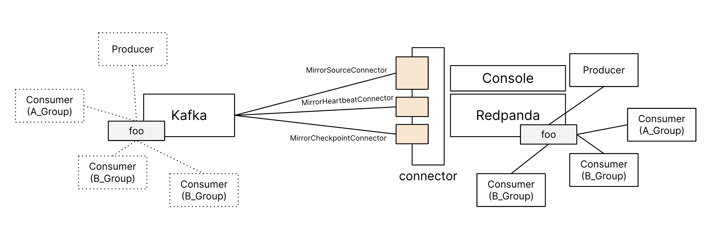
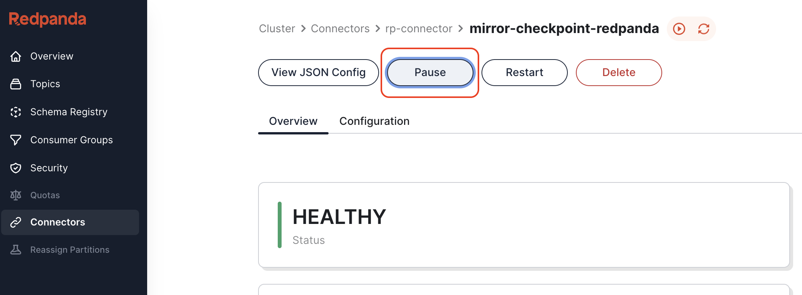
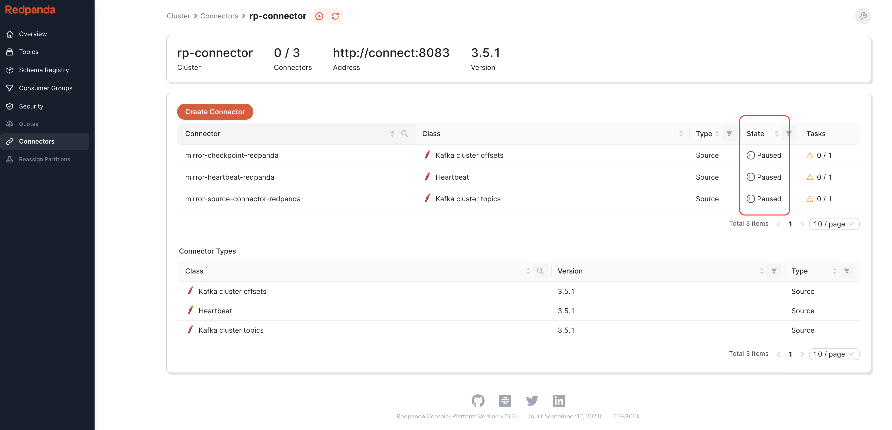

### Migrating consumers
We will now transfer all the consumer groups from the source cluster to the destination Redpanda cluster. The most challenging aspect of this migration is ensuring that there's no duplication in message processing.



Stop consumer in group A which are drawing from the source cluster:
```
docker stop  $(docker ps | grep mm2consumer-A | awk '{ print $1 }')
docker rm mm2consumer-A
```{{exec}}

Restart the consumer in the Group A and start consume from the new Redpanda cluster:
```
docker run -d --network=root_redpanda_network \
-e BOOTSTRAP_SERVERS='redpanda-0:9092' \
-e CONSUMER_GROUP='A_GROUP' \
--name mm2consumer-A \
weimeilin/mm2consumer 
```{{exec}}


Stop all the consumers of consumer group B which are drawing from the source cluster:
```
docker stop  $(docker ps | grep mm2consumer-B1 | awk '{ print $1 }')
docker stop  $(docker ps | grep mm2consumer-B2 | awk '{ print $1 }')

docker rm mm2consumer-B1
docker rm mm2consumer-B2
```{{exec}}

Restart the consumers group B and start consume from the new Redpanda cluster:
```
docker run -d --network=root_redpanda_network \
-e BOOTSTRAP_SERVERS='redpanda-0:9092' \
-e CONSUMER_GROUP='B_GROUP' \
--name mm2consumer-B1 \
weimeilin/mm2consumer 

docker run -d --network=root_redpanda_network \
-e BOOTSTRAP_SERVERS='redpanda-0:9092' \
-e CONSUMER_GROUP='B_GROUP' \
--name mm2consumer-B2 \
weimeilin/mm2consumer 
```{{exec}}


### Migrating producer
We're now shifting the producers from the source to the destination Redpanda cluster. In our setup, message order within the topic wasn't a concern. Given that data replication was ongoing, a simple restart of the producer will do the trick.

```
docker stop  $(docker ps | grep mm2producer | awk '{ print $1 }')
docker rm mm2producer
```{{exec}}

```
docker run -d --network=root_redpanda_network \
-e BOOTSTRAP_SERVERS='redpanda-0:9092' \
--name mm2producer \
weimeilin/mm2producer
```{{exec}}

### Pause all connectors
In [Redpanda Console]({{TRAFFIC_HOST1_8080}}/), back to the connector page, try to pause all 3 connectors, by going into each connector and click on the pause button.


And it should look like below


### Shut down Kafka and zookeeper

Now nothing is connected to the old cluster, we can go ahead and shut it down. 


```
docker stop  $(docker ps | grep root_kafka_1 | awk '{ print $1 }')
docker stop  $(docker ps | grep root_zookeeper_1 | awk '{ print $1 }')
docker rm root_kafka_1
docker rm root_zookeeper_1
```{{exec}}

Check only the new cluster and clients running: 
```
docker ps --format '{{.Names}}'
```{{exec}}

You should see only the following services:
```
#Clients
mm2producer
mm2consumer-B2
mm2consumer-B1
mm2consumer-A

redpanda-console
root_connect_1

#Redpanda Broker
redpanda-0
```

Check if all clients are still getting streamed data
```
docker logs -t mm2consumer-A
```{{exec}}

You'll see it start consuming 
```
2023-10-10T21:42:03.133955429Z Consumed start -- With group A_GROUP and BOOTSTRAP_SERVERS redpanda-0:9092
2023-10-10T21:42:03.134012203Z Consumed record. offset=102 key=b'48', value={'plantId': 48, 'botId': 'B56', 'fulfillment': 6}
2023-10-10T21:42:03.134022042Z Consumed record. offset=103 key=b'2', value={'plantId': 2, 'botId': 'B75', 'fulfillment': 4}
2023-10-10T21:42:03.134028401Z Consumed record. offset=104 key=b'12', value={'plantId': 12, 'botId': 'B88', 'fulfillment': 2}
2023-10-10T21:42:03.134049105Z Consumed record. offset=105 key=b'95', value={'plantId': 95, 'botId': 'B61', 'fulfillment': 3}
2023-10-10T21:42:03.134053083Z Consumed record. offset=106 key=b'82', value={'plantId': 82, 'botId': 'B42', 'fulfillment': 6}
2023-10-10T21:42:03.134056299Z Consumed record. offset=107 key=b'23', value={'plantId': 23, 'botId': 'B33', 'fulfillment': 6}
2023-10-10T21:42:03.134059383Z Consumed record. offset=108 key=b'98', value={'plantId': 98, 'botId': 'B53', 'fulfillment': 6}
2023-10-10T21:42:03.134062571Z Consumed record. offset=109 key=b'95', value={'plantId': 95, 'botId': 'B38', 'fulfillment': 4}
2023-10-10T21:42:03.134066097Z Consumed record. offset=110 key=b'67', value={'plantId': 67, 'botId': 'B15', 'fulfillment': 2}
2023-10-10T21:42:03.134069128Z Consumed record. offset=111 key=b'18', value={'plantId': 18, 'botId': 'B82', 'fulfillment': 4}
2023-10-10T21:42:03.134076470Z Consumed record. offset=112 key=b'12', value={'plantId': 12, 'botId': 'B65', 'fulfillment': 2}
2023-10-10T21:42:03.134080577Z Consumed record. offset=113 key=b'69', value={'plantId': 69, 'botId': 'B48', 'fulfillment': 6}
2023-10-10T21:42:03.134095211Z Consumed record. offset=114 key=b'51', value={'plantId': 51, 'botId': 'B25', 'fulfillment': 3}
2023-10-10T21:42:03.134099476Z Consumed record. offset=115 key=b'38', value={'plantId': 38, 'botId': 'B99', 'fulfillment': 6}
2023-10-10T21:42:03.134102686Z Consumed record. offset=116 key=b'15', value={'plantId': 15, 'botId': 'B37', 'fulfillment': 3}
2023-10-10T21:42:03.134105819Z Consumed record. offset=117 key=b'43', value={'plantId': 43, 'botId': 'B97', 'fulfillment': 2}
2023-10-10T21:42:03.134108827Z Consumed record. offset=118 key=b'85', value={'plantId': 85, 'botId': 'B98', 'fulfillment': 4}
2023-10-10T21:42:03.134111755Z Consumed record. offset=119 key=b'38', value={'plantId': 38, 'botId': 'B25', 'fulfillment': 4}
2023-10-10T21:42:03.134114936Z Consumed record. offset=120 key=b'45', value={'plantId': 45, 'botId': 'B29', 'fulfillment': 6}
2023-10-10T21:42:03.134117849Z Consumed record. offset=121 key=b'63', value={'plantId': 63, 'botId': 'B31', 'fulfillment': 3}
2023-10-10T21:42:03.134122393Z Consumed record. offset=122 key=b'86', value={'plantId': 86, 'botId': 'B18', 'fulfillment': 5}
2023-10-10T21:42:03.134125551Z Consumed record. offset=123 key=b'72', value={'plantId': 72, 'botId': 'B4', 'fulfillment': 6}
2023-10-10T21:42:03.134128679Z Consumed record. offset=124 key=b'93', value={'plantId': 93, 'botId': 'B49', 'fulfillment': 6}
2023-10-10T21:42:03.134131682Z Consumed record. offset=125 key=b'91', value={'plantId': 91, 'botId': 'B100', 'fulfillment': 3}
2023-10-10T21:42:03.134151930Z Consumed record. offset=126 key=b'10', value={'plantId': 10, 'botId': 'B83', 'fulfillment': 6}
2023-10-10T21:42:03.134156026Z Consumed record. offset=127 key=b'89', value={'plantId': 89, 'botId': 'B0', 'fulfillment': 5}
2023-10-10T21:42:03.134159089Z Consumed record. offset=128 key=b'45', value={'plantId': 45, 'botId': 'B97', 'fulfillment': 6}
2023-10-10T21:42:03.134162150Z Consumed record. offset=129 key=b'94', value={'plantId': 94, 'botId': 'B26', 'fulfillment': 5}
2023-10-10T21:42:03.134165268Z Consumed record. offset=130 key=b'61', value={'plantId': 61, 'botId': 'B52', 'fulfillment': 3}
...
```

```
docker logs -t mm2consumer-B1
```{{exec}}

You'll see it start consuming for group B
```
2023-10-10T21:42:03.138435633Z Consumed start -- With group B_GROUP and BOOTSTRAP_SERVERS redpanda-0:9092
2023-10-10T21:42:03.138493863Z Consumed record. offset=102 key=b'48', value={'plantId': 48, 'botId': 'B56', 'fulfillment': 6}
2023-10-10T21:42:03.138500735Z Consumed record. offset=103 key=b'2', value={'plantId': 2, 'botId': 'B75', 'fulfillment': 4}
2023-10-10T21:42:03.138505222Z Consumed record. offset=104 key=b'12', value={'plantId': 12, 'botId': 'B88', 'fulfillment': 2}
2023-10-10T21:42:03.138509421Z Consumed record. offset=105 key=b'95', value={'plantId': 95, 'botId': 'B61', 'fulfillment': 3}
2023-10-10T21:42:03.138513286Z Consumed record. offset=106 key=b'82', value={'plantId': 82, 'botId': 'B42', 'fulfillment': 6}
2023-10-10T21:42:03.138517269Z Consumed record. offset=107 key=b'23', value={'plantId': 23, 'botId': 'B33', 'fulfillment': 6}
2023-10-10T21:42:03.138534751Z Consumed record. offset=108 key=b'98', value={'plantId': 98, 'botId': 'B53', 'fulfillment': 6}
2023-10-10T21:42:03.138539077Z Consumed record. offset=109 key=b'95', value={'plantId': 95, 'botId': 'B38', 'fulfillment': 4}
2023-10-10T21:42:03.138542285Z Consumed record. offset=110 key=b'67', value={'plantId': 67, 'botId': 'B15', 'fulfillment': 2}
2023-10-10T21:42:03.138545331Z Consumed record. offset=111 key=b'18', value={'plantId': 18, 'botId': 'B82', 'fulfillment': 4}
2023-10-10T21:42:03.138548871Z Consumed record. offset=112 key=b'12', value={'plantId': 12, 'botId': 'B65', 'fulfillment': 2}
2023-10-10T21:42:03.138552773Z Consumed record. offset=113 key=b'69', value={'plantId': 69, 'botId': 'B48', 'fulfillment': 6}
2023-10-10T21:42:03.138556689Z Consumed record. offset=114 key=b'51', value={'plantId': 51, 'botId': 'B25', 'fulfillment': 3}
2023-10-10T21:42:03.138560823Z Consumed record. offset=115 key=b'38', value={'plantId': 38, 'botId': 'B99', 'fulfillment': 6}
2023-10-10T21:42:03.138564894Z Consumed record. offset=116 key=b'15', value={'plantId': 15, 'botId': 'B37', 'fulfillment': 3}
2023-10-10T21:42:03.138569000Z Consumed record. offset=117 key=b'43', value={'plantId': 43, 'botId': 'B97', 'fulfillment': 2}
2023-10-10T21:42:03.138631307Z Consumed record. offset=118 key=b'85', value={'plantId': 85, 'botId': 'B98', 'fulfillment': 4}
2023-10-10T21:42:03.138664975Z Consumed record. offset=119 key=b'38', value={'plantId': 38, 'botId': 'B25', 'fulfillment': 4}
2023-10-10T21:42:03.138699332Z Consumed record. offset=120 key=b'45', value={'plantId': 45, 'botId': 'B29', 'fulfillment': 6}
2023-10-10T21:42:03.138711328Z Consumed record. offset=121 key=b'63', value={'plantId': 63, 'botId': 'B31', 'fulfillment': 3}
2023-10-10T21:42:03.138723052Z Consumed record. offset=122 key=b'86', value={'plantId': 86, 'botId': 'B18', 'fulfillment': 5}
2023-10-10T21:42:03.138748684Z Consumed record. offset=123 key=b'72', value={'plantId': 72, 'botId': 'B4', 'fulfillment': 6}
2023-10-10T21:42:03.138758744Z Consumed record. offset=124 key=b'93', value={'plantId': 93, 'botId': 'B49', 'fulfillment': 6}
2023-10-10T21:42:03.138768318Z Consumed record. offset=125 key=b'91', value={'plantId': 91, 'botId': 'B100', 'fulfillment': 3}
2023-10-10T21:42:03.138807812Z Consumed record. offset=126 key=b'10', value={'plantId': 10, 'botId': 'B83', 'fulfillment': 6}
2023-10-10T21:42:03.138819426Z Consumed record. offset=127 key=b'89', value={'plantId': 89, 'botId': 'B0', 'fulfillment': 5}
...
```
Congratulation, you have completed migrating from Kafka to Redpanda cluster.