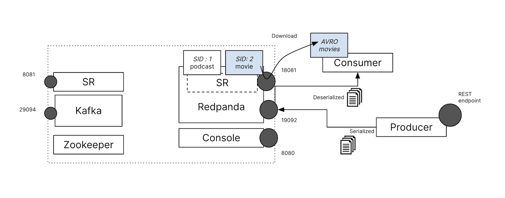
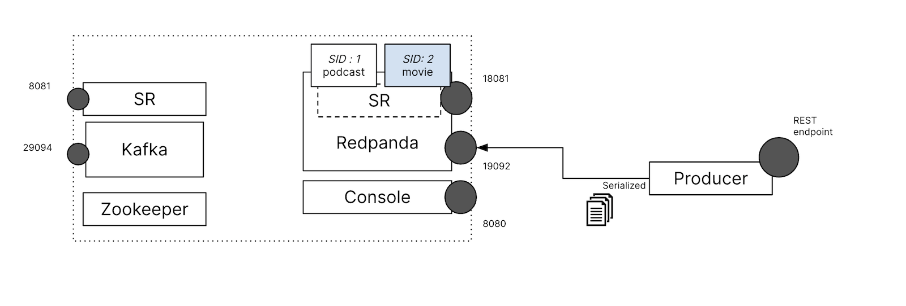
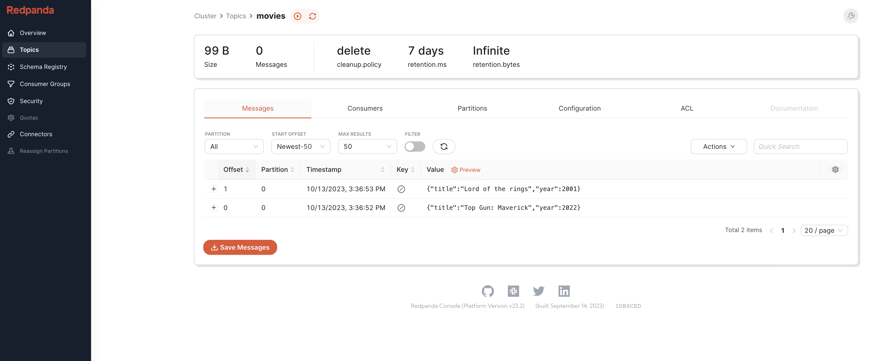
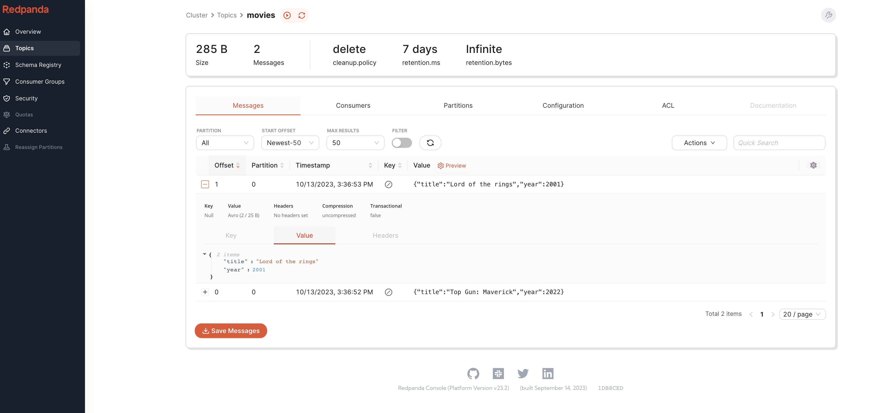
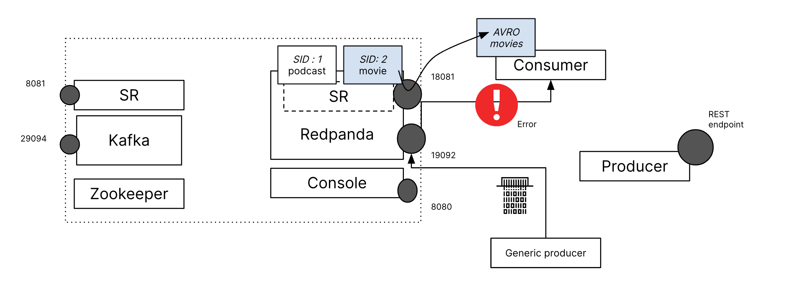
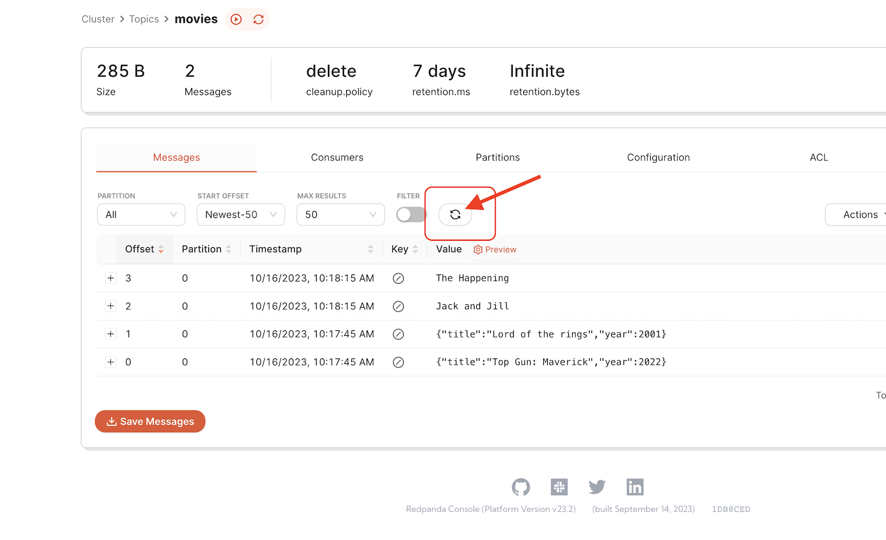

### Migrating producer and consumers

We are now have the producer and consumer point to the new Redpanda cluster, to do this, we need to update the broker location.  For producer, navigate to the editor tab. In the left explorer panel, drill down to the directory path _quarkus-apps/avro-schema-producer/src/main/resources_ and open the **application.properties** file. 

- Replace the old broker from _kafka.bootstrap.servers=PLAINTEXT://localhost:29094_ to `kafka.bootstrap.servers=PLAINTEXT://localhost:19092`
- Replace the old registry from _mp.messaging.connector.smallrye-kafka.schema.registry.url=http://localhost:8081_ to `mp.messaging.connector.smallrye-kafka.schema.registry.url=http://localhost:18081`

And apply the same change to consumer, by updating the **application.properties** file under directory _quarkus-apps/avro-schema-consumer/src/main/resources_.

Replace schemaRegistryUrls pom.xml under _quarkus-apps/avro-schema-consumer/_, this is for the consumer to download the latest schema during compile time. In _tab 1_ run: 
```
sed -i 's/localhost:8081/localhost:18081/g' /root/quarkus-apps/avro-schema-consumer/pom.xml
```{{exec}}


Go to_tab 3_ and stop the process with `Ctrl+C` (if it's not already stopped), and then restart with the following command::
```
cd /root/quarkus-apps/avro-schema-consumer/
./mvnw process-resources install quarkus:run -Dquarkus.http.port=9091
```{{exec}}

Wait until the consumer is fully started.
```
[io.quarkus] (main) avro-schema-consumer 1.0.0-SNAPSHOT on JVM (powered by Quarkus 3.4.2) started in 7.474s. Listening on: http://0.0.0.0:9091
```



In _tab 2_, and restart the producer, it will also be connecting to the new Redpanda cluster:
```
cd /root/quarkus-apps/avro-schema-producer/
./mvnw generate-resources install quarkus:run -Dquarkus.http.port=9090
```{{exec}}

Wait until the producer is fully started.
```
[io.quarkus] (main) avro-schema-producer 1.0.0-SNAPSHOT on JVM (powered by Quarkus 3.4.2) started in 3.420s. Listening on: http://0.0.0.0:9090
```

In _tab 1_, let's send some movie entries
```
curl --header "Content-Type: application/json" \
  --request POST \
  --data '{"title":"Top Gun: Maverick","year":2022}' \
  http://localhost:9090/movies

curl --header "Content-Type: application/json" \
  --request POST \
  --data '{"title":"Lord of the rings","year":2001}' \
  http://localhost:9090/movies
```{{exec}}

Go to [Redpanda Console]({{TRAFFIC_HOST1_8080}}/).  In the topic view section, select the **movies** topic. You should now see the entries. 



Take note that it has been correctly decoded. The Redpanda Console automatically identifies the serialization type of the data, making it more user-friendly and straightforward for viewers



However, what if the data ingested into the topic doesn't adhere to the schema? Let's put this to the test, click on the **+** icon at the top to add a new tab, labeled _tab 4_. In _tab 4_ run, 
```
export PATH="~/.local/bin:$PATH"
rpk topic produce movies --brokers localhost:19092 
```{{exec}}



You now have a generic producer that will send what ever was prompted in the command line to the broker, please randomly enter some text and hit enter (Or two worst movies in all times!):

```
Jack and Jill
The Happening
```{{exec}}

Check the [Redpanda Console]({{TRAFFIC_HOST1_8080}}/), you'll see the entry in the **movies**Topic view (Refresh the topic needed).



Return to _tab 3_ where the consumer was running. Did you see the conspicuous red error messages? This is because the consumer couldn't decode your input and consequently raised complaints.

```
ERROR [org.dem.ConsumedMovieResource] (vert.x-eventloop-thread-0) ERROR: java.lang.NullPointerException: UNKNOWN DATA, CANNOT PROCESS!!
        at org.demo.ConsumedMovieResource.receive(ConsumedMovieResource.java:17)
        at org.demo.ConsumedMovieResource_ClientProxy.receive(Unknown Source)
        at org.demo.ConsumedMovieResource_SmallRyeMessagingInvoker_receive_1aa9d1f0d6aca1790c3a69d2a0bd700254b777d9.invoke(Unknown Source)
        at io.smallrye.reactive.messaging.providers.AbstractMediator.invoke(AbstractMediator.java:141)
        at io.smallrye.reactive.messaging.providers.AbstractMediator.lambda$invokeOnMessageContext$8(AbstractMediator.java:149)
        at io.smallrye.reactive.messaging.providers.locals.LocalContextMetadata.lambda$invokeOnMessageContext$0(LocalContextMetadata.java:34)
        at io.smallrye.reactive.messaging.providers.locals.LocalContextMetadata.lambda$invokeOnMessageContext$1(LocalContextMetadata.java:53)
        at io.smallrye.reactive.messaging.providers.helpers.VertxContext.runOnContext(VertxContext.java:24)
        at io.smallrye.reactive.messaging.providers.locals.LocalContextMetadata.lambda$invokeOnMessageContext$2(LocalContextMetadata.java:51)
        at io.smallrye.context.impl.wrappers.SlowContextualConsumer.accept(SlowContextualConsumer.java:21)
        at io.smallrye.mutiny.operators.uni.builders.UniCreateWithEmitter.subscribe(UniCreateWithEmitter.java:22)
        at io.smallrye.mutiny.operators.AbstractUni.subscribe(AbstractUni.java:36)
        at io.smallrye.mutiny.operators.uni.UniOnItemOrFailureFlatMap.subscribe(UniOnItemOrFailureFlatMap.java:27)
        at io.smallrye.mutiny.operators.AbstractUni.subscribe(AbstractUni.java:36)
        at io.smallrye.mutiny.converters.uni.UniToMultiPublisher$UniToMultiSubscription.request(UniToMultiPublisher.java:73)
        at io.smallrye.mutiny.subscription.SwitchableSubscriptionSubscriber.setOrSwitchUpstream(SwitchableSubscriptionSubscriber.java:205)
        at io.smallrye.mutiny.subscription.SwitchableSubscriptionSubscriber.onSubscribe(SwitchableSubscriptionSubscriber.java:107)
        at io.smallrye.mutiny.converters.uni.UniToMultiPublisher.subscribe(UniToMultiPublisher.java:25)
        at io.smallrye.mutiny.groups.MultiCreate$1.subscribe(MultiCreate.java:165)
        at io.smallrye.mutiny.operators.multi.MultiConcatMapOp$ConcatMapMainSubscriber.onItem(MultiConcatMapOp.java:144)
        at io.smallrye.mutiny.operators.multi.MultiMapOp$MapProcessor.onItem(MultiMapOp.java:50)
        at io.smallrye.mutiny.operators.multi.MultiOperatorProcessor.onItem(MultiOperatorProcessor.java:99)
        at io.smallrye.reactive.messaging.providers.locals.ContextOperator$ContextMulti$ContextProcessor.lambda$onItem$1(ContextOperator.java:71)
        at io.smallrye.reactive.messaging.providers.helpers.VertxContext.lambda$runOnContext$0(VertxContext.java:26)
        at io.vertx.core.impl.ContextInternal.dispatch(ContextInternal.java:277)
        at io.vertx.core.impl.ContextInternal.dispatch(ContextInternal.java:259)
        at io.vertx.core.impl.EventLoopContext.lambda$runOnContext$0(EventLoopContext.java:43)
        at io.netty.util.concurrent.AbstractEventExecutor.runTask(AbstractEventExecutor.java:174)
        at io.netty.util.concurrent.AbstractEventExecutor.safeExecute(AbstractEventExecutor.java:167)
        at io.netty.util.concurrent.SingleThreadEventExecutor.runAllTasks(SingleThreadEventExecutor.java:470)
        at io.netty.channel.nio.NioEventLoop.run(NioEventLoop.java:569)
        at io.netty.util.concurrent.SingleThreadEventExecutor$4.run(SingleThreadEventExecutor.java:997)
        at io.netty.util.internal.ThreadExecutorMap$2.run(ThreadExecutorMap.java:74)
        at io.netty.util.concurrent.FastThreadLocalRunnable.run(FastThreadLocalRunnable.java:30)
        at java.base/java.lang.Thread.run(Thread.java:829)
```

That's less than ideal. Fortunately, with Redpanda, we have a solution to mitigate such issues. Let's proceed to the next step and explore how this can be done.
