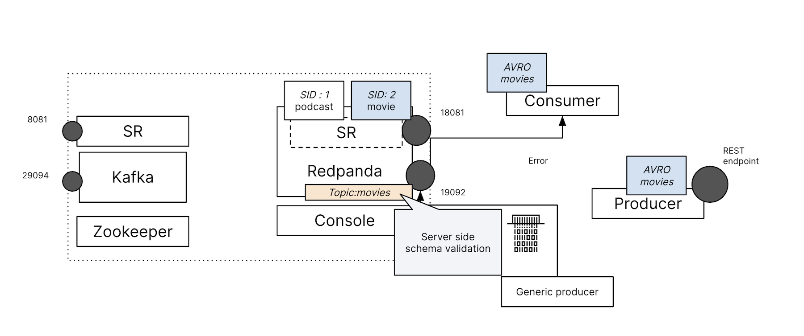
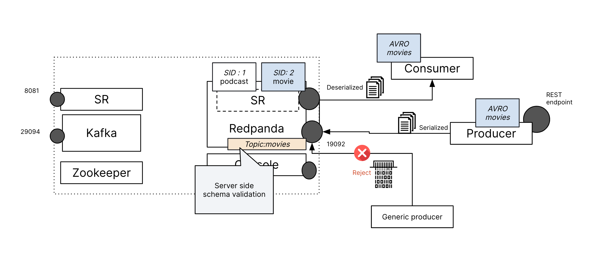

### Enable Server-side Schema ID Validation

Schema ID validation allows brokers to identify and discard records that either originate from an incorrectly configured subject name strategy, don't adhere to the SerDes wire format, or have an incorrect schema ID encoded. This validation ensures that records with unregistered schemas are identified and rejected at the broker level, rather than waiting until they reach a consumer. It's important to note that this validation does not evaluate the payload itself.



By default, server-side schema ID validation is disabled in Redpanda. To enable schema ID validation, change the enable_schema_id_validation cluster property via admin port in _tab 1_:

```
export PATH="~/.local/bin:$PATH"
rpk cluster config set enable_schema_id_validation redpanda --api-urls=localhost:19644
```{{exec}}

Enable the topic for Schema ID validation, we will be using the _TopicNameStrategy_, matching the old cluster config.
```
rpk topic alter-config movies \
  --set redpanda.value.schema.id.validation=true \
  --set redpanda.value.subject.name.strategy=TopicNameStrategy \
  -X brokers=localhost:19092
```{{exec}}



Return to _tab 4_ where your rpk producer should still be active. Attempt to send some more terrible movie names to the topic by typing it and pressing enter.

```
The Last Airbender
```{{exec}}

You will be prompt with following error, indicating that the broker rejected the data due to a failure in schema validation. 
```
unable to produce record: INVALID_RECORD: This record has failed the validation on broker and hence be rejected.
```

Now try and send more movie record with the producer, as it will provide the correct schema id, it should pass the validation.

```
curl --header "Content-Type: application/json" \
  --request POST \
  --data '{"title":"Spider-Man: Across the Spider-Verse ","year":2023}' \
  http://localhost:9090/movies

curl --header "Content-Type: application/json" \
  --request POST \
  --data '{"title":"The Nightmare Before Christmas","year":1993}' \
  http://localhost:9090/movies

curl --header "Content-Type: application/json" \
  --request POST \
  --data '{"title":" The Super Mario Bros. Movie","year":2023}' \
  http://localhost:9090/movies

curl --header "Content-Type: application/json" \
  --request POST \
  --data '{"title":"Coraline","year":2009}' \
  http://localhost:9090/movies
```{{exec}}

You can see the consumer printout the data, add it should also appear in the Redpanda Console under the topic **movies**. 

Excellent! You've not only successfully migrated your schema from the old registry but also enabled schema validation. With Redpanda, you now benefit from:

- An all-in-one binary solution (Broker + Schema Registry) without the need for Zookeeper.
- An intuitive Redpanda Console that provides an overview of cluster activities.
- Reduced risk of errors due to schema validation.

Congratulations on completing your schema migration to Redpanda!