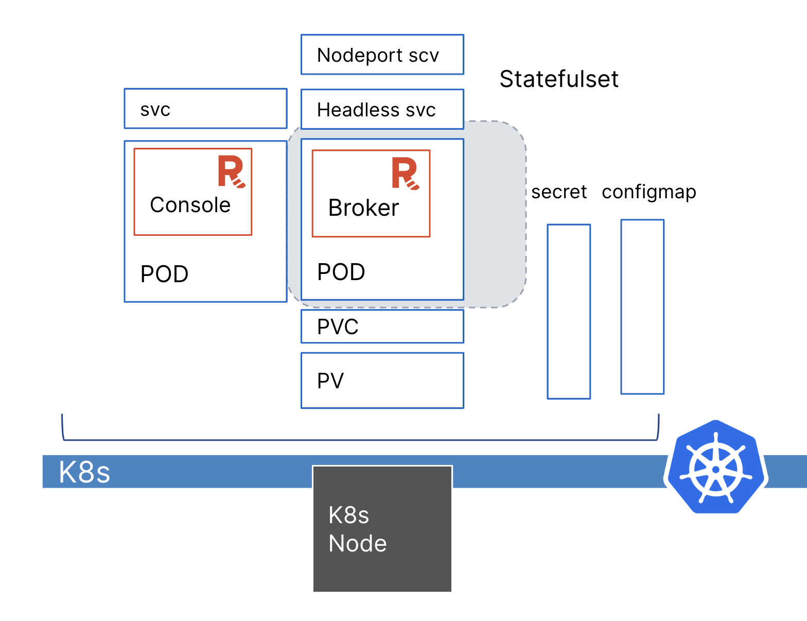

Redpanda recommends using the Redpanda Helm chart for all new deployments. For detailed information about running Redpanda in Kubernetes, see the [Redpanda documentation](https://docs.redpanda.com/docs/deploy/deployment-option/self-hosted/kubernetes).

Tools in this tutorial:

- Helm: This helps you define, install, and upgrade applications running on Kubernetes.
- `kubectl`: The Kubernetes command-line tool lets you deploy applications, inspect and manage cluster resources, and view logs in Kubernetes cluster. 
- `rpk`: The Redpanda command-line tool lets you manage your entire Redpanda cluster, without the need to run a separate script for each function, as with Apache Kafka. The `rpk` commands handle everything from configuring nodes and low-level tuning to high-level general Redpanda tasks. 

The following diagram shows all components in the cluster. 



First, to install the Redpanda Helm chart repository, run: 

```
helm repo add redpanda https://charts.redpanda.com
```{{exec}}

Note: In a production environment, you need to allocate sufficient numbers of CPU cores. Because this tutorial runs in a restricted environment with very low hardware capacity limits, you'll see warnings about the minimum recommended resource. Redpanda works fine with these limitations.

In the Kubernetes cluster, you'll isolate the Redpanda components in a logical namespace called `redpanda`. 

To create the namespace, run:

```
kubectl create namespace redpanda
```{{exec}}

Install the Redpanda Operator custom resource definitions (CRDs):
```
kubectl kustomize https://github.com/redpanda-data/redpanda//src/go/k8s/config/crd | kubectl apply -f -
```{{exec}}

Deploy the Redpanda Operator:
```
helm upgrade --install redpanda-controller redpanda/operator \
  --namespace redpanda \
  --set image.repository=docker.redpanda.com/redpandadata/redpanda-operator \
  --set image.tag=v23.2.14 \
  --create-namespace \
  --timeout 10m
```{{exec}}

Ensure that the Deployment is successfully rolled out:

```
kubectl --namespace redpanda rollout status --watch deployment/redpanda-controller-operator

```{{exec}}

```
deployment "redpanda-controller-operator" successfully rolled out
```
And the operator is ready to 
```
kubectl get pod -n redpanda
```{{exec}}
```
NAME                                            READY   STATUS    RESTARTS   AGE
redpanda-controller-operator-7cf59c7454-s775x   2/2     Running   0          3m22s
```


Install a Redpanda custom resource in the same namespace as the Redpanda Operator:
```
cat <<EOF | kubectl -n redpanda apply -f -
apiVersion: cluster.redpanda.com/v1alpha1
kind: Redpanda
metadata:
  name: redpanda
spec:
  chartRef: {}
  clusterSpec:
    statefulset:
      replicas: 1
    tls:
      enabled: false
    resource:
      cpu:
        overprovisioned: true
        cores: 300m
      memory:
        container:
          max: 1025Mi
        redpanda:
          reserveMemory: 1Mi
          memory: 1Gi
    auth:
      sasl:
        enabled: false
    storage:
      persistentVolume:
        enabled: true
        size: 2Gi
        storageClass: datadir-redpanda-0
    console:
      enabled: false
EOF
```{{exec}}


To confirm that the broker is up, run:

```
kubectl -n redpanda get pod
```{{exec}}

The following status confirms that a Redpanda broker is running. 
``` 
NAME                           READY   STATUS      RESTARTS   AGE
redpanda-0                     1/1     Running     0          2m50s
```

Redpanda is ready to roll in Kubernetes! 