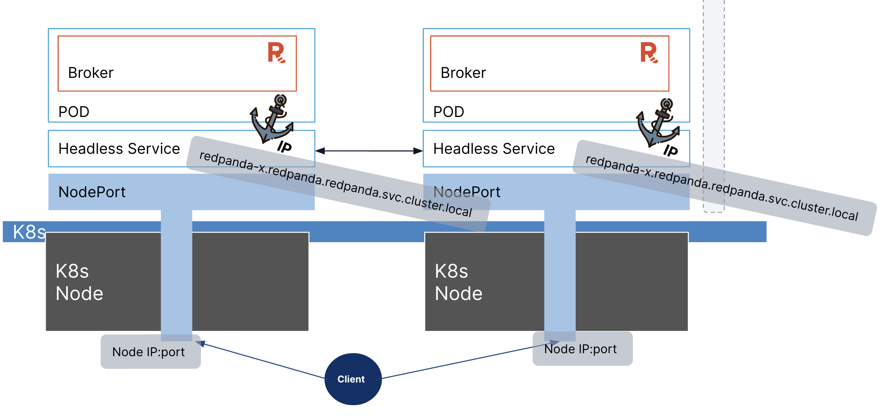
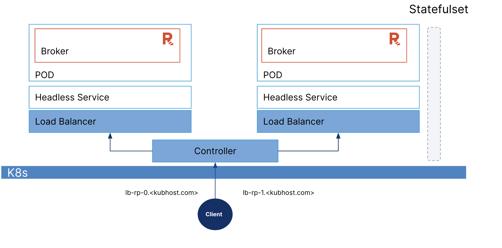
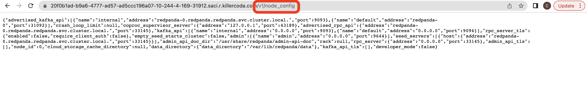

By default, Redpanda brokers are exposed through a NodePort Service. 



To display the services available, go back to **Tab1**, and run:

```
kubectl -n redpanda get svc
```{{exec}}


It displays a headless service that explicitly sets ClusterIP to `None`, so it discovers individual service brokers in each Pod. The `redpanda-external` service is the NodePort Service that allows external access to the Redpanda broker with the external IP bound to the Kubernetes worker node.

```
NAME                       TYPE        CLUSTER-IP      EXTERNAL-IP   PORT(S)                                                       AGE
operator-metrics-service   ClusterIP   10.102.212.90   <none>        8443/TCP                                                      7m14s
redpanda                   ClusterIP   None            <none>        9644/TCP,8082/TCP,9093/TCP,33145/TCP,8081/TCP                 6m48s
redpanda-external          NodePort    10.99.53.203    <none>        9645:31644/TCP,9094:31092/TCP,8083:30082/TCP,8084:30081/TCP   6m48s
```


Normally you'll use the external IP of the K8s worker node where your broker is hosted. But in this tutorial, the K8s worker node is bound to 0.0.0.0. The following table shows how the client can access the broker service, both inside and outside the Kubernetes cluster. 

| Listener  | K8s Internal IP & Port | External IP & Port |
| -------- | ------- | ------- |
| Admin API | redpanda-0.redpanda.redpanda.svc.cluster.local:9644 |	0.0.0.0:31644 |
| Kafka	| redpanda-0.redpanda.redpanda.svc.cluster.local:9094 |	0.0.0.0:31092 |
| HTTP Proxy | redpanda-0.redpanda.redpanda.svc.cluster.local:8083 | 0.0.0.0:30082 |
| Schema Registry | redpanda-0.redpanda.redpanda.svc.cluster.local:8084 | 0.0.0.0:30081 |


Try using the internal address for HTTP Proxy to publish an event. 

On **Tab1**, run:

Note: This executes the curl command in the K8s Pod.

```
kubectl -n redpanda exec -ti redpanda-0 -c redpanda -- curl -s \
  -X POST \
  "http://redpanda-0.redpanda.redpanda.svc.cluster.local:8083/topics/demo-topic" \
  -H "Content-Type: application/vnd.kafka.json.v2+json" \
  -d '{
    "records": [
        { 
            "value": "Hello world!"
        }
    ]
}'
```{{exec}}


On **Tab2** (where you have the consumer open), you see the event:

```
{
  "topic": "demo-topic",
  "value": "\"Hello world!\"",
  "timestamp": 1679971100372,
  "partition": 0,
  "offset": 1
}
```


Next, you'll connect externally through the NodePort endpoint. 

On **Tab1**, run: 

Note: This executes the curl command outside K8s cluster.

```
curl -s \
  -X POST \
  "http://0.0.0.0:30082/topics/demo-topic" \
  -H "Content-Type: application/vnd.kafka.json.v2+json" \
  -d '{
    "records": [
        { 
            "value": "Hello Universe!"
        }
    ]
}'
```{{exec}}


On **Tab2** (where you have the consumer open), you see the event:

```
{
  "topic": "demo-topic",
  "value": "\"Hello Universe!\"",
  "timestamp": 1679971457079,
  "partition": 0,
  "offset": 4
}
```


You don't need to use NodePort: Redpanda also supports LoadBalancer Services. Next, you'll create a LoadBalancer Service for each broker. 



On **Tab1**, run the following to install the LoadBalancer Service:

```
cat <<EOF | kubectl -n redpanda apply -f -
apiVersion: v1
kind: Service
metadata:
  name: lb-redpanda-0
  namespace: redpanda
spec:
  type: LoadBalancer
  ports:
    - name: schemaregistry
      targetPort: 8081
      port: 8081
    - name: http
      targetPort: 8082
      port: 8082
    - name: kafka
      targetPort: 9093
      port: 9093
    - name: admin
      targetPort: 9644
      port: 9644
  selector:
    statefulset.kubernetes.io/pod-name: redpanda-0
EOF
```{{exec}}


There should be an additional LoadBalancer Service. It now binds your Redpanda service to your default K8s domain. 

To again display the services available, run:

```
kubectl -n redpanda get svc
```{{exec}}


In this tutorial, the K8s domain is also bound to 0.0.0.0. (Normally, your worker node IP & K8s domain should be different.) 

```
NAME                TYPE           CLUSTER-IP       EXTERNAL-IP   PORT(S)                                                       AGE
lb-redpanda-0       LoadBalancer   10.104.112.167   <pending>     8081:30533/TCP,8082:30376/TCP,9093:31748/TCP,9644:31103/TCP   6s
operator-metrics-service   ClusterIP      10.102.212.90   <none>        8443/TCP
redpanda            ClusterIP      None             <none>        <none>                                                        22m
redpanda-external   NodePort       10.99.142.230    <none>        9644:31644/TCP,9094:31092/TCP,8083:30082/TCP,8084:30081/TCP   22m
```


The following table shows how the client can access the broker service outside of the K8s cluster. 

**Warning: Ports are randomly chosen, so your external bound port will be different.**

| Listener  | K8s Internal IP & Port | External IP & Port |
| -------- | ------- | ------- |
| Admin API | redpanda-0.redpanda.redpanda.svc.cluster.local:9644 |	0.0.0.0:31103 |
| Kafka	| redpanda-0.redpanda.redpanda.svc.cluster.local:9093 |	0.0.0.0:31748 |
| HTTP Proxy | redpanda-0.redpanda.redpanda.svc.cluster.local:8082 | 0.0.0.0:30376 |
| Schema Registry | redpanda-0.redpanda.redpanda.svc.cluster.local:8081 | 0.0.0.0:30533 |


Now try connecting externally through the NodePort endpoint. 

On **Tab1**, run:

```
LB_HTTP_PORT=$(kubectl -n redpanda get svc lb-redpanda-0 -o json | jq '.spec.ports[] | select (.name=="http")| .nodePort')
curl -s \
  -X POST \
  "http://0.0.0.0:$LB_HTTP_PORT/topics/demo-topic" \
  -H "Content-Type: application/vnd.kafka.json.v2+json" \
  -d '{
    "records": [
        { 
            "value": "Hello Milky Way!"
        }
    ]
}'
```{{exec}}


On **Tab2** (where you had the consumer open), you can see the event:

```
{
  "topic": "demo-topic",
  "value": "\"Hello Milky Way!\"",
  "timestamp": 1679972709426,
  "partition": 0,
  "offset": 5
}
```{{exec}}


Try to access the Kakfa Admin API. 

On **Tab1**, run the following command to print the Admin API port:

```
kubectl -n redpanda get svc lb-redpanda-0 -o json | jq '.spec.ports[] | select (.name=="admin")| .nodePort'
```{{exec}}


To access the Admin API, [go to the Traffic Port Accessor]({{TRAFFIC_SELECTOR}}).

For **Custom Ports**, enter your Admin API external port printed from the previous step, and click **Access**.

A new browser window/tab opens:

```
{"message": "Not found", "code": 404}
```


This is not an error. To get the broker configurations, add `/v1/node_config` to the URL and refresh the page.



On **Tab2**, click **ctl+C** to terminate the consumer processes. 

On **Tab3**, click **ctl+C** to terminate the producer processes. 

