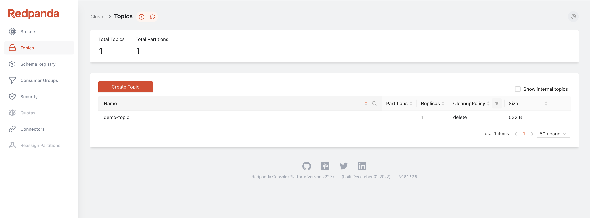
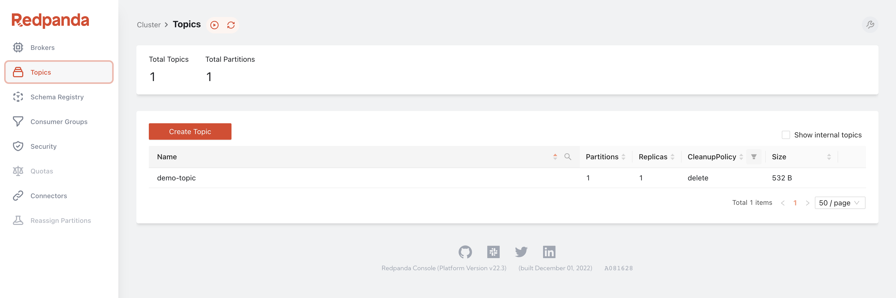
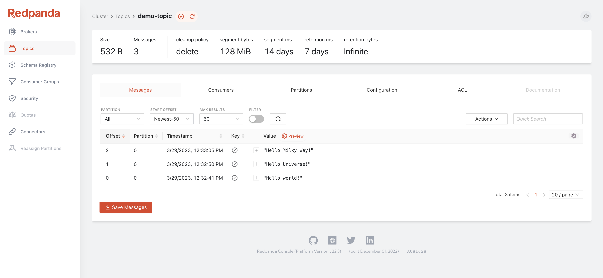
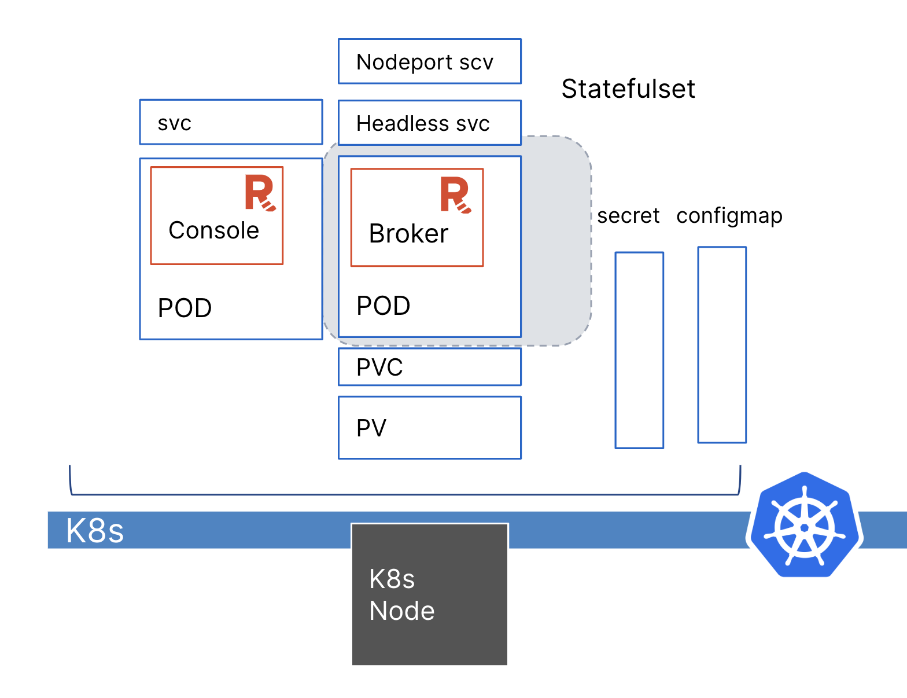

Updating and patching a Redpanda cluster is fairly straightforward with Helm.
You can use the parameter, like how you deployed the cluster at the beginning of the tutorial, or you can create a YAML file with the new settings.

In this step, you add and spin up Redpanda Console. Redpanda Console is a developer-friendly UI for managing your workloads. You've enabled the console to deploy as well as set up an ingress endpoint, so you can access the console externally.  




```
cat <<EOF | kubectl -n redpanda apply -f -
apiVersion: cluster.redpanda.com/v1alpha1
kind: Redpanda
metadata:
  name: redpanda
spec:
  chartRef: {}
  clusterSpec:
    clusterSpec:
    statefulset:
      replicas: 1
    tls:
      enabled: false
    resources:
      cpu:
        overprovisioned: true
        cores: 300m
      memory:
        container:
          max: 1025Mi
        redpanda:
          reserveMemory: 1Mi
          memory: 1Gi
    auth:
      sasl:
        enabled: false
    storage:
      persistentVolume:
        enabled: true
        size: 2Gi
    console:
      enabled: true
      ingress:
        enabled: true
        hosts:
        - paths:
            - path: /
              pathType: ImplementationSpecific
EOF
```{{exec}}

Give it a minute or two, and your console should be deployed and ready. 
```
kubectl get redpanda --namespace redpanda --watch
```{{exec}}
```
Redpanda reconciliation succeeded
```


Check the running pods.
```
kubectl -n redpanda get pod
```{{exec}}


You see the redpanda-console Pod running. 

```
NAME                                READY   STATUS      RESTARTS   AGE
redpanda-0                                      2/2     Running     0               4m1s
redpanda-configuration-vzm5f                    0/1     Completed   0               3m1s
redpanda-console-5f6c7d84d7-bm5x7               1/1     Running     2 (3m36s ago)   4m3s
redpanda-controller-operator-5b9dd599cc-92qqp   2/2     Running     0               36m
redpanda-post-upgrade-452f5                     0/1     Completed   0               2m55s
```


To see an ingress endpoint installed, run:

```
kubectl -n redpanda get ingress
```{{exec}}


It should be bound to port 80.

```
NAME               CLASS    HOSTS   ADDRESS     PORTS   AGE
redpanda-console   <none>   *       localhost   80      26m
```


Give it a couple of minutes to start. (Refresh it if you see 503 Service Temporarily Unavailable. This is a very limited cluster.)

Click [Redpanda Console]({{TRAFFIC_HOST1_80}}/) to access it in your browser.

You'll see the `demo-topic` you created in Step 2.



Click **demo-topic** to display all your event streaming.



Congratulations on completing this tutorial with all components installed.



Happy Streaming!