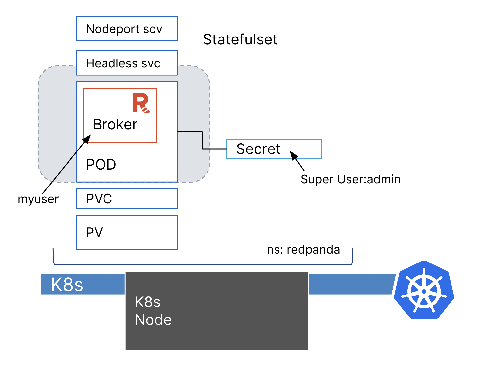

By enforcing authentication and authorization mechanisms, you can control who has access to Redpanda and what actions they can perform. Fine-grained access control ensures that only authorized users or applications can read, write, or manage Kafka topics, preventing unauthorized modifications or unauthorized access to sensitive data.

You must create the superuser. This user has ALL permissions on the cluster and is the user that grants permissions to new users. Without a superuser, you can create other users, but you will not be able to grant them permissions to the cluster.



With Kubernetes, it's best practice to use use a Secret to store sensitive configuration, in this case the superuser credentials,st

```
echo 'admin:admin:SCRAM-SHA-256' >> superusers.txt
kubectl create secret generic redpanda-superusers -n redpanda --from-file=superusers.txt
```{{exec}}

Update the Redpanda cluster by enabling SASL and create the superuser using the secret that you just created:
```
cat <<EOF | kubectl -n redpanda apply -f -
apiVersion: cluster.redpanda.com/v1alpha1
kind: Redpanda
metadata:
  name: redpanda
spec:
  chartRef: 
    upgrade:
      force: true
  clusterSpec:
    statefulset:
      replicas: 1
    tls:
      enabled: true
    resources:
      cpu:
        overprovisioned: true
        cores: 300m
      memory:
        container:
          max: 1025Mi
        redpanda:
          reserveMemory: 1Mi
          memory: 1Gi
    auth:
      sasl:
        enabled: true
        secretRef: redpanda-superusers
    storage:
      persistentVolume:
        enabled: true
        size: 2Gi
    console:
      enabled: true
      ingress:
        enabled: true
        hosts:
        - paths:
            - path: /
              pathType: ImplementationSpecific
EOF
```{{exec}} 

Let's now try getting the cluster without the user credentials:
```
rpk cluster info \
  --tls-enabled \
  --tls-truststore cae.crt \
  --brokers localhost:31092
```{{exec}}

It should fail and ask for SASL input:
```
unable to request metadata: broker closed the connection immediately after a request was issued, which happens when SASL is required but not provided: is SASL missing?
```

Let's add the user and password and try again:

```
rpk cluster info \
  --user admin \
  --password admin \
  --sasl-mechanism SCRAM-SHA-256 \
  --tls-enabled \
  --tls-truststore cae.crt \
  --brokers localhost:31092
```{{exec}}

You should be able to see the cluster information this time:
```
CLUSTER
=======
redpanda.f57be314-84ea-45f3-9201-6922c5c7cc17

BROKERS
=======
ID    HOST       PORT
0*    localhost  31092

TOPICS
======
NAME        PARTITIONS  REPLICAS
_schemas    1           1
test-topic  1           1
```

Once you have created the superuser, you can now create new users and authorize users or applications for different purpose. When creating users, set SCRAM to provide strong encryption for user names and passwords by default and does not require an external data store for user information. Redpanda supports the following SASL mechanisms:

- SCRAM-SHA-256
- SCRAM-SHA-512

The normal users are not part of K8s configuration, they are stored and manages in the Redpanda cluster. Therefore we will be using _RPK_ tools to create the user.

Let's download the certificate for admin port:
```
kubectl -n redpanda get secret redpanda-default-cert -o go-template='{{ index .data "ca.crt" | base64decode }}' > admin.crt
```{{exec}}

Create user via *rpk*:
```
rpk acl user create myuser -p '1234qwer' \
  --admin-api-tls-enabled \
  --admin-api-tls-truststore admin.crt \
  --user admin \
  --password admin \
  --sasl-mechanism SCRAM-SHA-256 \
  --api-urls localhost:31644
```{{exec}}

By default, new users don't have any permissions in the cluster. The superuser can grant permissions to new users through ACLs. Let's use the *rpk* command to grant create and describe cluster permissions to the user:
```
rpk acl create --allow-principal User:myuser \
  --operation create,describe \
  --cluster \
  --user admin \
  --password 'admin' \
  --sasl-mechanism SCRAM-SHA-256 \
  --tls-enabled \
  --tls-truststore cae.crt \
  --brokers localhost:31092
```{{exec}}

You'll see now the user now have create and describe permission: 
```
PRINCIPAL    HOST  RESOURCE-TYPE  RESOURCE-NAME  RESOURCE-PATTERN-TYPE  OPERATION  PERMISSION  ERROR
User:myuser  *     CLUSTER        kafka-cluster  LITERAL                CREATE     ALLOW       
User:myuser  *     CLUSTER        kafka-cluster  LITERAL                DESCRIBE   ALLOW    
```

A user must be explicitly granted describe privileges for topics. Even if a user has describe privileges for a cluster, it does not mean that the user is automatically granted describe privileges for a specific topic.

Let's try describe a topic using the user we've create, since we have not yet granted describe privileges for topics, it is going to fail:

```
rpk topic describe test-topic \
  --user myuser \
  --password '1234qwer' \
  --sasl-mechanism SCRAM-SHA-256 \
  --tls-enabled \
  --tls-truststore cae.crt \
  --brokers localhost:31092
```{{exec}}

It should show _Topic authorization failed_:

```
SUMMARY
=======
NAME        test-topic
PARTITIONS  0
ERROR       TOPIC_AUTHORIZATION_FAILED: Not authorized to access topics: [Topic authorization failed.]

CONFIGS
=======
config response contained error: TOPIC_AUTHORIZATION_FAILED: Not authorized to access topics: [Topic authorization failed.]
```

Go ahead and grant all privileges for Topic *test-topic* to myuser:
```
rpk acl create --allow-principal User:myuser \
  --operation all \
  --topic test-topic \
  --user admin \
  --password 'admin' \
  --sasl-mechanism SCRAM-SHA-256 \
  --tls-enabled \
  --tls-truststore cae.crt \
  --brokers localhost:31092
```{{exec}}


Let's try to describe the topic again:

```
rpk topic describe test-topic \
  --user myuser \
  --password '1234qwer' \
  --sasl-mechanism SCRAM-SHA-256 \
  --tls-enabled \
  --tls-truststore cae.crt \
  --brokers localhost:31092
```{{exec}}

You should be able to see the details about the topic:
```
SUMMARY
=======
NAME        test-topic
PARTITIONS  1
REPLICAS    1

CONFIGS
=======
KEY                           VALUE       SOURCE
cleanup.policy                delete      DYNAMIC_TOPIC_CONFIG
compression.type              producer    DEFAULT_CONFIG
max.message.bytes             1048576     DEFAULT_CONFIG
message.timestamp.type        CreateTime  DEFAULT_CONFIG
redpanda.remote.delete        true        DEFAULT_CONFIG
redpanda.remote.read          false       DEFAULT_CONFIG
redpanda.remote.write         false       DEFAULT_CONFIG
retention.bytes               -1          DEFAULT_CONFIG
retention.local.target.bytes  -1          DEFAULT_CONFIG
retention.local.target.ms     86400000    DEFAULT_CONFIG
retention.ms                  604800000   DEFAULT_CONFIG
segment.bytes                 134217728   DEFAULT_CONFIG
segment.ms                    1209600000  DEFAULT_CONFIG
```

Congrats, you have successfully enforcing authentication and authorization to your Redpanda with SASL in K8s.