Grafana is a popular open-source monitoring tool used in Kubernetes. It enables the creation of visually appealing dashboards and graphs to visualize and analyze metrics collected from various data sources, including Prometheus. Redpanda provides template Grafana dashboards with guidelines and example queries using Redpanda's public metrics to monitor it's performance and health.

Again, with limited capacity, adjust the storage for Grafana to 2 GB: 
```
cat <<EOF | kubectl -n monitoring apply -f -
apiVersion: v1
kind: PersistentVolumeClaim
metadata:
  annotations:
    volume.beta.kubernetes.io/storage-provisioner: rancher.io/local-path
    volume.kubernetes.io/storage-provisioner: rancher.io/local-path
  name: grafana-pvc
  namespace: monitoring
spec:
  accessModes:
  - ReadWriteOnce
  resources:
    requests:
      storage: 2Gi
  storageClassName: local-path
  volumeMode: Filesystem
EOF
```{{exec}}

There are many ways to setup Grafana, such as helm or operator, but to make it simple, this time just use Kubernetes manifests for the setup:
```
cat <<EOF | kubectl -n monitoring apply -f -
apiVersion: apps/v1
kind: Deployment
metadata:
  labels:
    app: grafana
  name: grafana
spec:
  selector:
    matchLabels:
      app: grafana
  template:
    metadata:
      labels:
        app: grafana
    spec:
      securityContext:
        fsGroup: 472
        supplementalGroups:
          - 0
      containers:
        - name: grafana
          image: grafana/grafana:9.1.0
          imagePullPolicy: IfNotPresent
          ports:
            - containerPort: 3000
              name: http-grafana
              protocol: TCP
          readinessProbe:
            failureThreshold: 3
            httpGet:
              path: /robots.txt
              port: 3000
              scheme: HTTP
            initialDelaySeconds: 10
            periodSeconds: 30
            successThreshold: 1
            timeoutSeconds: 2
          livenessProbe:
            failureThreshold: 3
            initialDelaySeconds: 30
            periodSeconds: 10
            successThreshold: 1
            tcpSocket:
              port: 3000
            timeoutSeconds: 1
          resources:
            requests:
              cpu: 250m
              memory: 250Mi
          volumeMounts:
            - mountPath: /var/lib/grafana
              name: grafana-pv
      volumes:
        - name: grafana-pv
          persistentVolumeClaim:
            claimName: grafana-pvc
---
apiVersion: v1
kind: Service
metadata:
  name: grafana
spec:
  ports:
    - port: 3000
      protocol: TCP
      targetPort: http-grafana
  selector:
    app: grafana
  sessionAffinity: None
EOF
```{{exec}}

Check if the Grafana pod is ready and running:
```
kubectl get pod -n monitoring
```{{exec}}

You should be able to see a grafana instance is ready and in running state:
```
NAME                                                 READY   STATUS    RESTARTS   AGE
grafana-bf6c9bd55-z8f7r                              1/1     Running   0          82s
```


Run the following command to export Grafana Dashboard:
```
kubectl -n monitoring delete Ingress prometheus-ingress
cat <<EOF | kubectl -n monitoring apply -f -
apiVersion: networking.k8s.io/v1
kind: Ingress
metadata:
  name: grafana-ingress
  annotations:
    ingress.kubernetes.io/rewrite-target: /
spec:
    rules:
    - http:
        paths:
        - backend:
            service:
              name: grafana
              port:
                number: 3000
          path: /
          pathType: ImplementationSpecific
EOF
```{{exec}}

Give it a couple of minutes to start. (Refresh it if you see 503 Service Temporarily Unavailable. This is a very limited cluster.) Click [Grafana Console]({{TRAFFIC_HOST2_80}}/) to access it in your browser. Login with ID/PWD, admin/admin
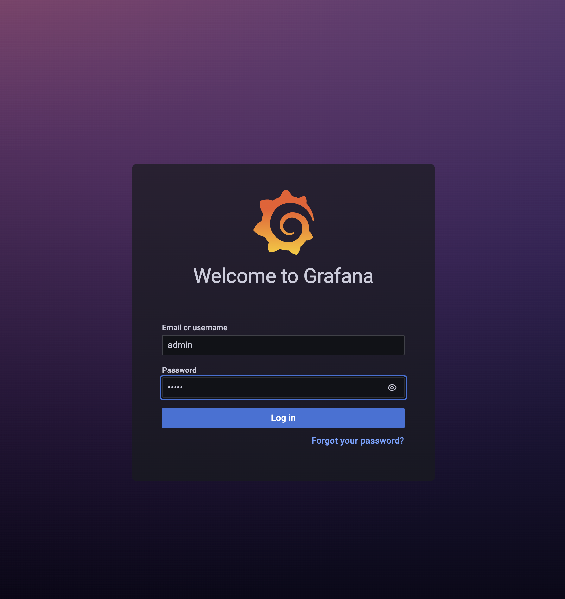

(_NOTE_ if you keep getting Error 502 *Bad Gateway*, that probably means the Ingress was hosted on another host in this tutorial env. go to [ACCESS PORTS]({{TRAFFIC_SELECTOR}}) and try click on both 80 port, one of them should work.)

Skip the password change:
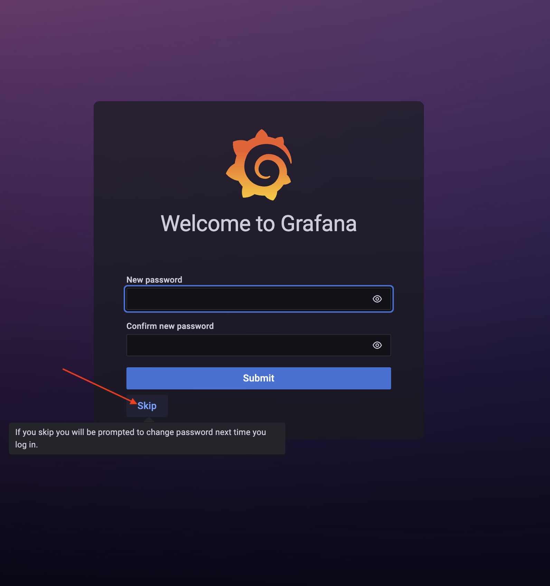

In the [Grafana Console]({{TRAFFIC_HOST2_80}}/), configure the data source, by click on the "Add your first data source" tile in the home page.
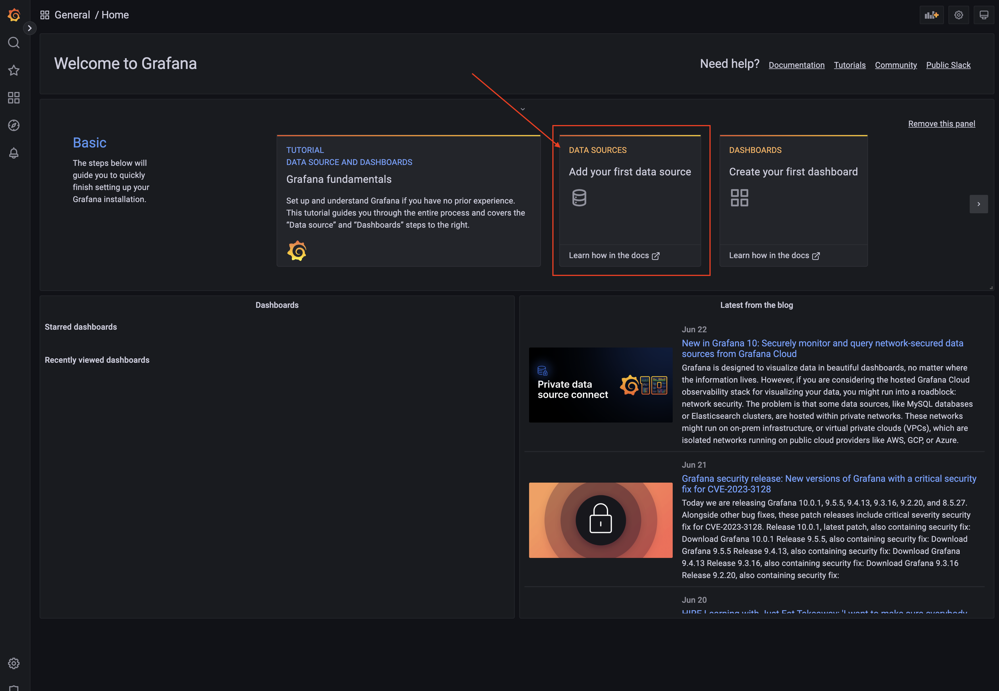

Select Prometheus, 
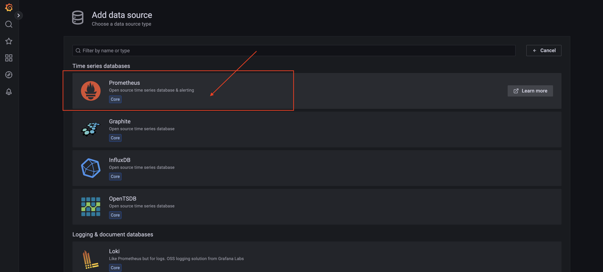

In the Configure page for Prometheus, set _URL_ to *http://prometheus-server:80* and click on Save & test at the bottom of the page.
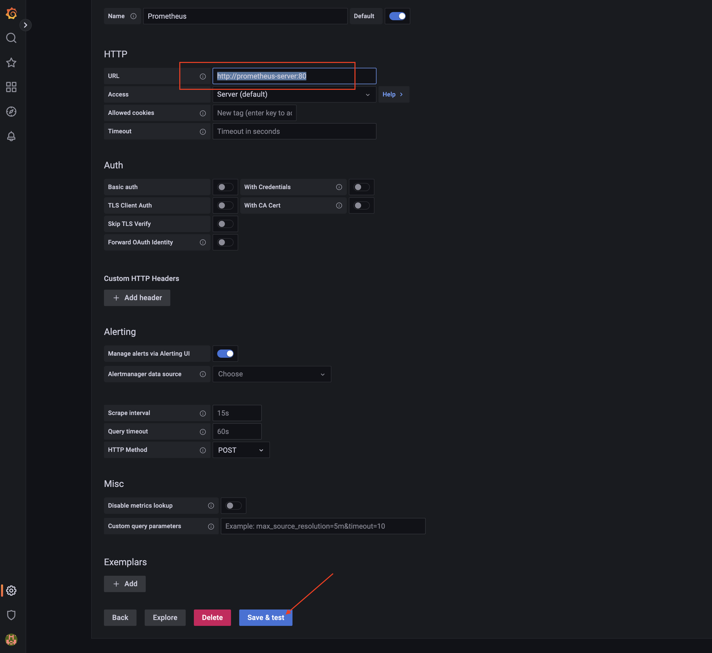

Click the Grafana icon on the top of left menu bar to go back to the home age, and we are now ready to import the Redpanda template dashboards.These are metrics to help detect and mitigate anomalous system behaviors, capture baseline metrics of your healthy system at different stages (at start-up, under high load, in steady state) so you can set thresholds and alerts according to those baselines.

To import, hover over the the _Dashboard_ item on the left menu and select _+ Import_
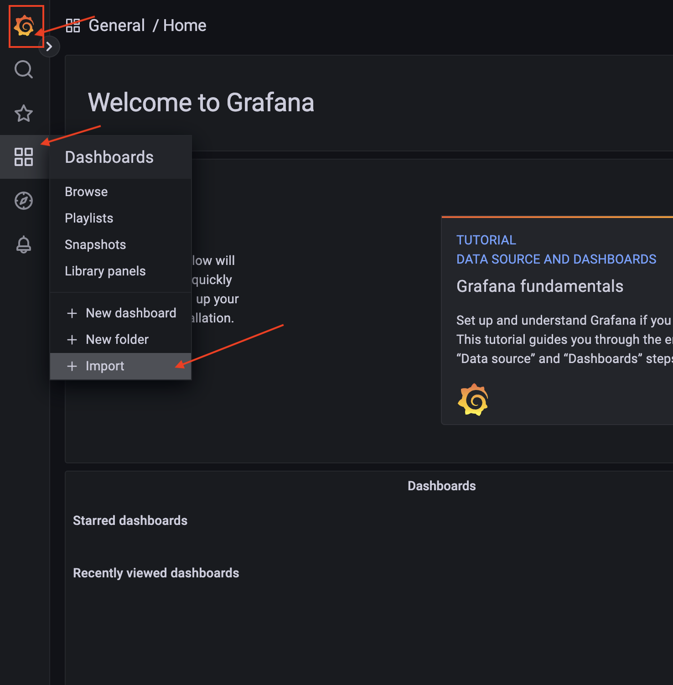

All the Redpanda dashboards can be found in the [Grafana Marketplace](https://grafana.com/grafana/dashboards/), go to the site and type *redpanda* in the search box, you will see several of them, 
the recommend one are: 

- *Redpanda Ops Dashboard*: For operating Redpanda clusters, that shows an overview of the cluster such as number of node, partitions, topic. Health of the cluster such as the storage, CPU and memory utilization, also the performance of the cluster,such as throughput, latency and RPC. Lastly it indicates some signs of problems such as leaderless partitions.
- *Kafka Topic Metrics*: A deeper dive into Topic metrics, shows the records received and the read/write throughput for each topics. 
- *Kafka Consumer Offsets*: Focusing on consumer offsets, showing which consumer groups are falling behind and  consumption rate by each groups.

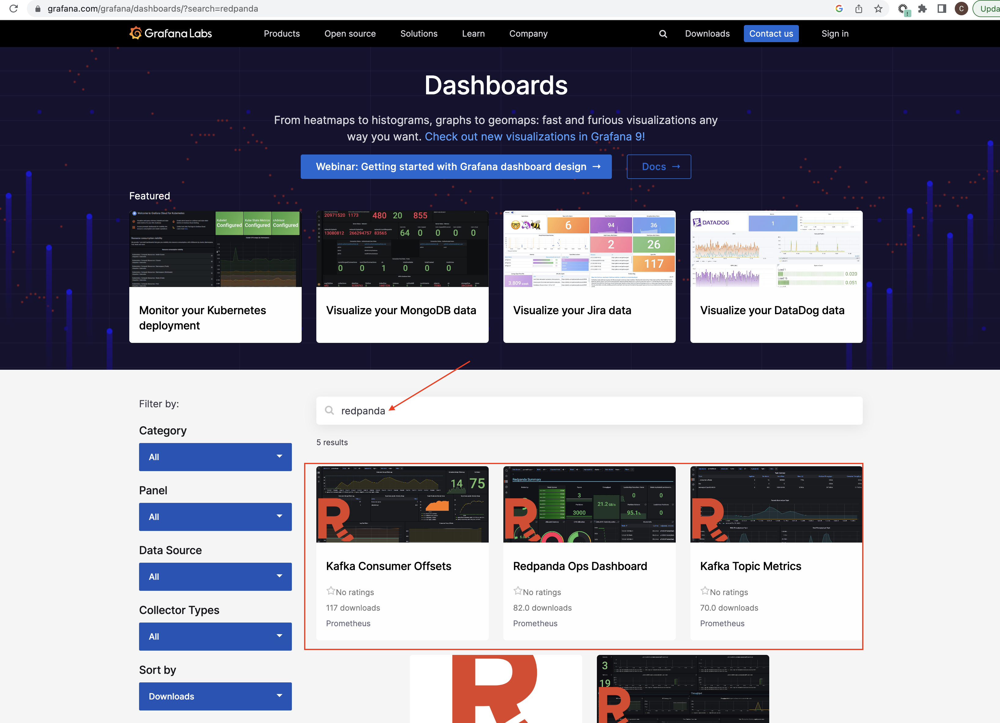


In the marketplace click into Redpanda Ops Dashboard, and click on _Copy ID to clipboard_:
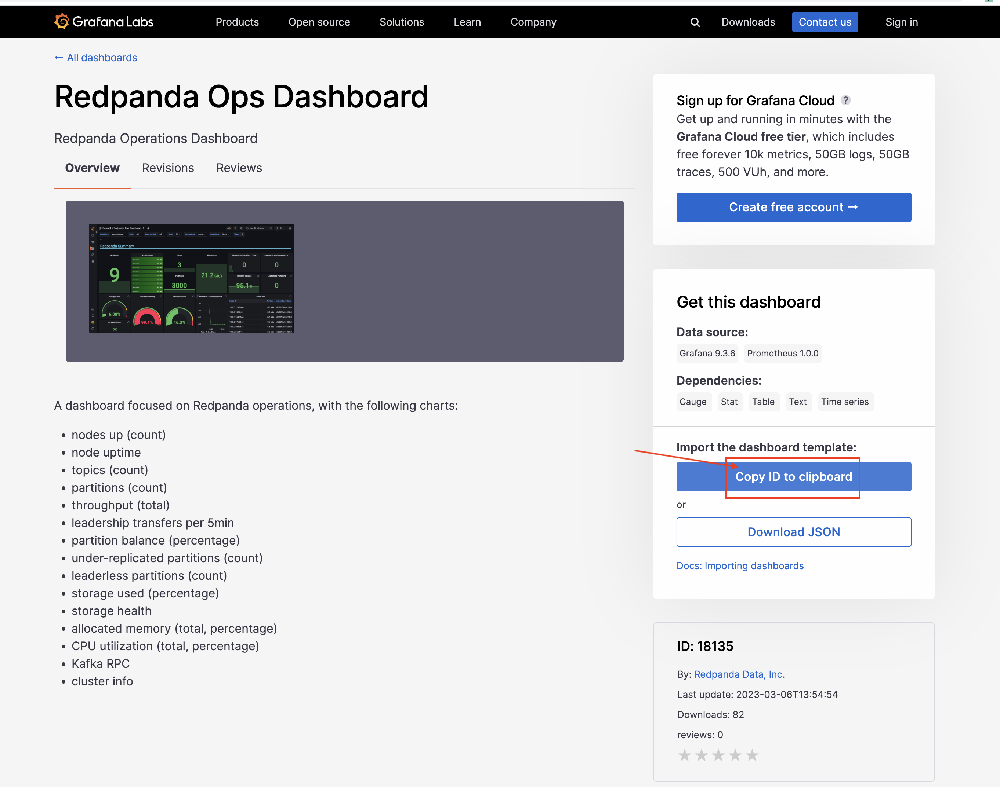

In the marketplace click into Redpanda Ops Dashboard, and click on _Copy ID to clipboard_:


Paste the ID into the Grafana Import via Grafana box and click _Load_:
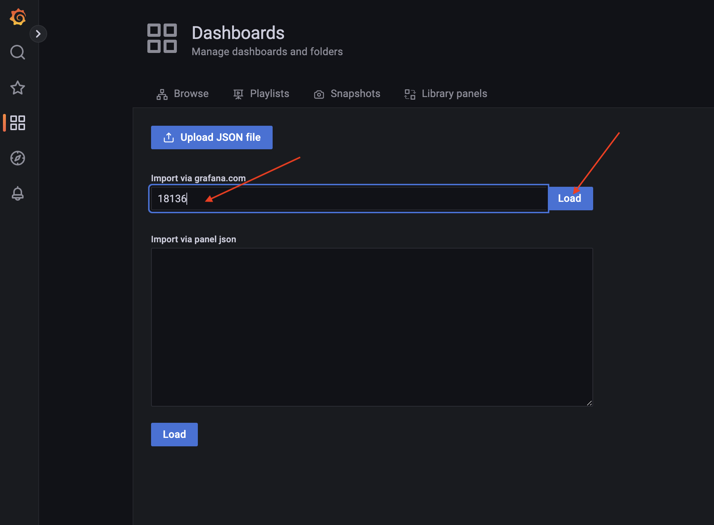

In the next page, select Prometheus from the drop down menu as the data source, and click _Import_:


Feel free to import all three dashboard mentioned above,but make sure you at least import the *Redpanda Ops Dashboard* for this tutorial. In the home page, you should be able to see the dashboard you just imported.

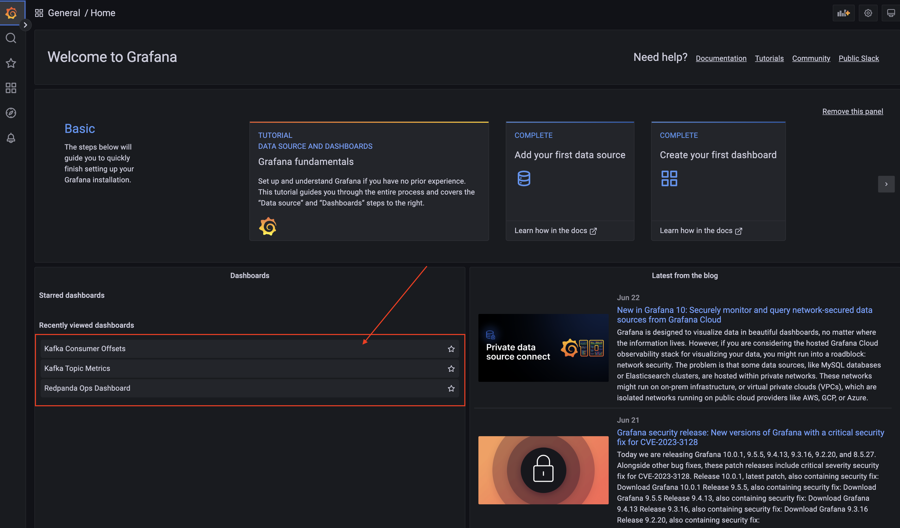

Let's get some action going, by running the *produce-data.sh*, it will start producing data into a topic call demo-topic. 

```
./produce-data.sh
```{{exec}}

Give it a minutes to run. Go back [Grafana Console]({{TRAFFIC_HOST2_80}}/), and select the *Redpanda OPS Dashboard* on the homepage. And you will be able to see metrics appear in the OPS dashboard. 

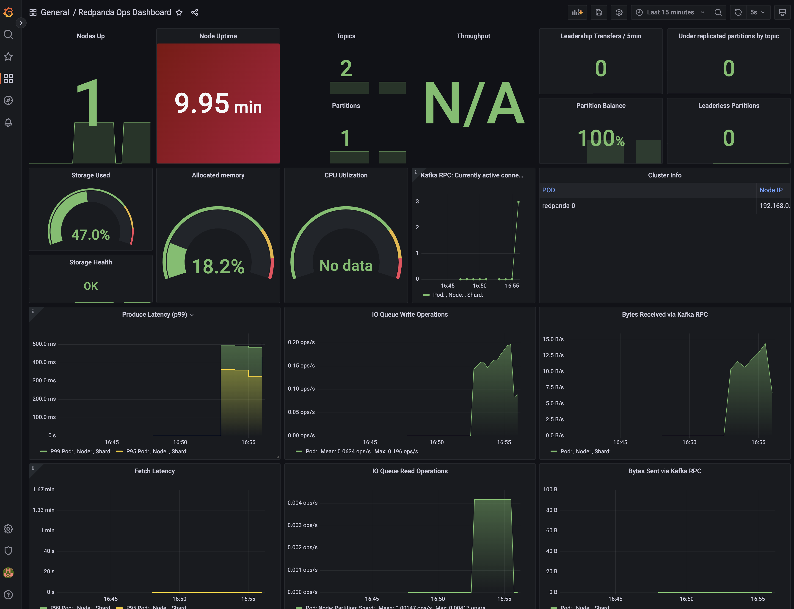
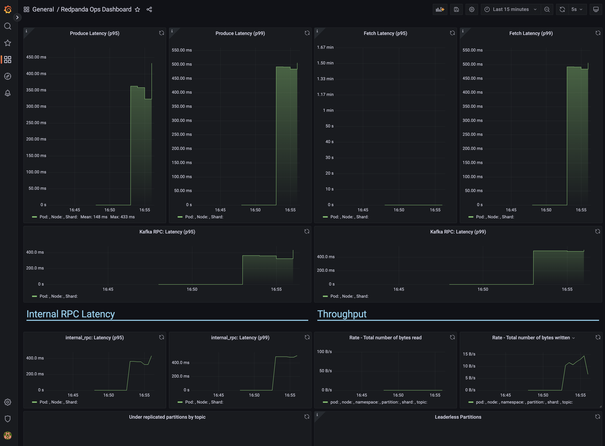

Hit **ctl+C** to terminate the *produce-data* producer processes. Congratulations, you have successfully setup Grafana to view metrics for monitoring Redpanda. 