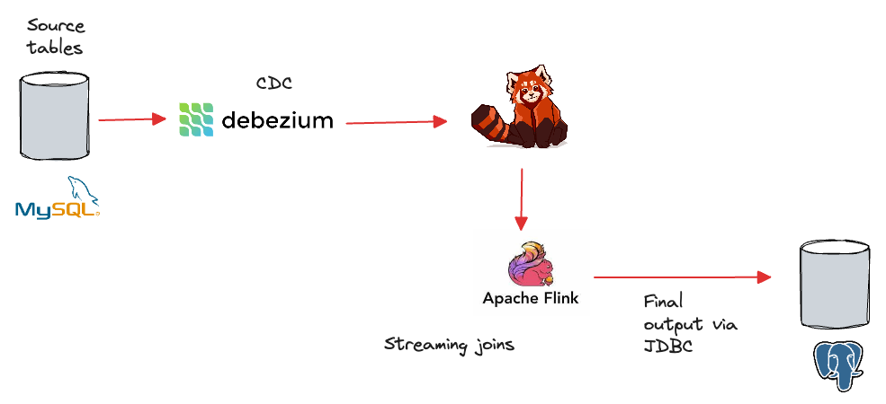

Assume we have an online store that uses MySQL as the transactional database, capturing operational information, such as orders, payments, products, etc.

The business wants to know key metrics like top-selling products to stay on alert on the inventory levels. To achieve that, we will build a data pipeline that moves transactional data from MySQL to Postgres, which we will use for running analytics later. 

You will build a streaming ETL pipeline capable of continuously extracting data from the source database, applying joins and transformations on the fly, and loading the final dataset to the target database. Once deployed, this pipeline keeps running forever, eliminating the need for scheduling, unlike the batch ETL pipeline in the previous scenario.

This pipeline consists of the following containers:
- `mysql` as the source database.
- `postgres` as the destination database.
- `redpanda` as the streaming data platform.
- `debezium` as the change data capture (CDC) agent.
- `jobmanager`, `taskmanager`, and `sql-client` as components of the Apache Flink cluster that does the streaming ETL.



Go ahead and start the services by running:

```
docker-compose up -d
```{{exec}}

It will take about 2-3 minutes to complete the startup. So, please wait patiently until you see the terminal returns to normal prompt.