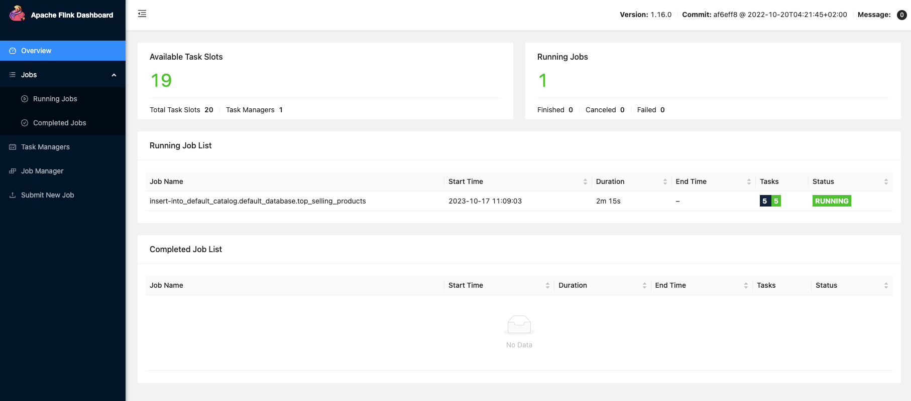

With the source and sink tables, what remains is to write a aggregation query that joins the `order_items` table `products` and aggregate the total.

Execute the following `insert into` query that does the above.

```sql
insert into top_selling_products
select i.payload.product_id as product_id, p.payload.product_name as product_name, sum(i.payload.total_price) as total_sales
from order_items i
inner join products p
on i.product_id=p.product_id
group by i.payload.product_id, p.payload.product_name;
```{{exec}}

That should result in an output like this on the terminal.

```
[INFO] SQL update statement has been successfully submitted to the cluster:
Job ID: a2cb48d4363d0c27e6ac316b574bfd36
```

When you run this query, the `sql-client` submits it to the `jobmanager`, resulting in a Flink job to be scheduled and run in the Flink cluster. The `Job ID` you see in the output corresponds to the job ID scheduled in the cluster.

Apache Flink has a UI that provides an overview of the Flink cluster, enabling you to track the status of jobs and tasks, view cluster logs, and more. When you started the Flink job manager at the beginning of this tutorial, you also started the UI. It's available at port `8081` by default.

Since this scenario is running on a dynamically provisioned machine, you'll need to get the URL of the Flink UI instance by running this command.

You can [access the Flink Console here]({{TRAFFIC_HOST1_8081}}/), which will open in a separate tab. 

If the job is healthy and running, you will see a screen like this.

